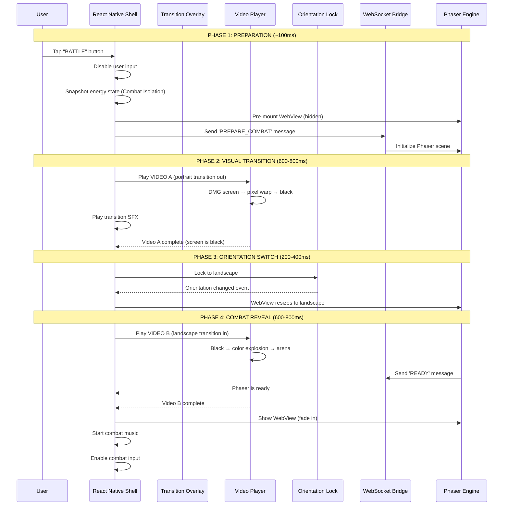
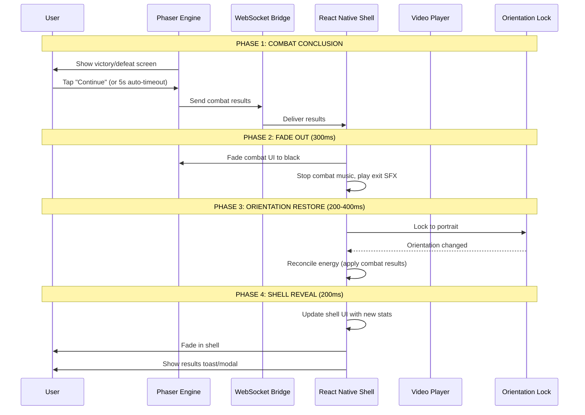

\# 16BitFit-V3 Fullstack Architecture Document

\#\# Introduction

This document outlines the complete fullstack architecture for \*\*16BitFit-V3\*\*, including backend systems, frontend implementation, and their integration. It serves as the single source of truth for AI-driven development, ensuring consistency across the entire technology stack. This unified approach combines what would traditionally be separate backend and frontend architecture documents, streamlining the development process for modern fullstack applications where these concerns are increasingly intertwined.

\#\#\# Starter Template or Existing Project

\*\*N/A \- Greenfield project\*\*

\*\*Rationale:\*\* While we are migrating \*concepts\* and \*learnings\* from 16BitFit V2 (a significant existing project), the BMAD migration strategy explicitly calls for a Greenfield \*rebuild\* using the BMAD Method structure. Therefore, we are not directly using V2's codebase as a starter template, although its architecture and innovations heavily inform this design. We will initialize a new project structure according to BMAD principles.

\#\#\# Change Log

| Date       | Version | Description                                       | Author  |
| :--------- | :------ | :------------------------------------------------ | :------ |
| 2025-10-23 | 0.1     | Initial document draft                            | Winston |
| 2025-10-24 | 0.2     | Integrated deep research synthesis findings       | Winston |
| 2025-12-04 | 0.3     | Performance validation strategy, rollback netcode readiness, CI performance gates, updated checklist | Winston |
| 2025-12-28 | 0.4     | Combat Transition Pipeline (4-phase sequence, two-part video transitions, orientation lock timing, edge case handling) | Cloud Dragonborn |
| 2025-12-31 | 0.5     | **Party Mode Updates:** (1) Champion model replaces CombatCharacterStats—6 cosmetic-only champions (Mario Party model); (2) BattleResult model with no-defeat philosophy (`victory` or `continue_training` outcomes); (3) UserProfile updated: selected_champion replaces selected_combat_character, fitness_momentum replaces fitness_streak | Winston |
| 2026-01-02 | 0.6     | **Cross-document alignment:** Fixed champion count (8→6); updated Database Schema DDL to use `selected_champion` and `fitness_momentum`; added `battle_results` table DDL; updated Tech Stack and External APIs sections for Runware API (replaces Stable Diffusion TBD) | BMad Master |
| 2026-01-05 | 0.7     | **Video Assets Pipeline (Party Mode):** Added FTUE Workout Video specs (~8-12s passive video, NOT interactive tracker). Defined hybrid hosting strategy (FTUE bundled, transitions on CDN). Added audio architecture for video transitions. Video creation via Nano Banana Pro + Veo 3.1. Reference: video-asset-specifications.md | Winston |

\#\# High Level Architecture

\#\#\# Technical Summary

The 16BitFit-V3 architecture employs a \*\*Hybrid Application Model\*\* designed for high performance and cross-platform compatibility. A React Native shell serves as the native container, providing access to device features (like HealthKit/Health Connect) and rendering the primary UI using a "Modern Retro Fusion" aesthetic. The core, high-performance SBFG combat experience is delivered via a Phaser 3 game engine running within an isolated WebView component. Communication between the React Native shell and the Phaser WebView is handled by the innovative \*\*Hybrid Velocity Bridge\*\*, implemented via a \*\*Local WebSocket Server \+ MessagePack\*\* protocol, targeting sub-10ms latency. The backend leverages Supabase as a Backend-as-a-Service (BaaS), providing database, real-time subscriptions (via Broadcast), authentication, and a \*\*hybrid logic model\*\* using both serverless Edge Functions (for ingress/external calls) and PostgreSQL Functions (for data-intensive logic). This architecture aims to achieve native-like 60fps combat performance within a mobile app framework while integrating real-world fitness data.

\#\#\# Platform and Infrastructure Choice

\*\*Platform Recommendation:\*\* \*\*Supabase\*\*

\*\*Rationale:\*\*  
1\.  \*\*V2 Success:\*\* The existing V2 architecture successfully utilized Supabase, proving its viability for the project's needs (database, real-time sync, edge functions).  
2\.  \*\*Developer Experience:\*\* Supabase offers a streamlined developer experience, integrating database, auth, and serverless functions, aligning with the goal of rapid iteration within the BMAD framework.  
3\.  \*\*Real-time:\*\* Built-in real-time capabilities via \*\*Broadcast\*\* (triggered by PG functions) offer better scalability than direct DB changes for this use case.  
4\.  \*\*Cost-Effectiveness:\*\* Generous free tier and predictable scaling costs align with MVP budget goals.  
5\.  \*\*Hybrid Logic:\*\* Supports both Edge Functions (Deno/TS) and PostgreSQL Functions (PL/pgSQL), allowing logic placement optimization.

\*\*Platform:\*\* \*\*Supabase\*\*  
\*\*Key Services:\*\*  
\* PostgreSQL Database (via Supabase DB)  
\* Realtime Subscriptions (Broadcast)  
\* Authentication (Supabase Auth)  
\* Edge Functions (Deno-based)  
\* PostgreSQL Functions (PL/pgSQL)  
\* Storage (if needed for user-uploaded content beyond avatar generation)  
\*\*Deployment Host and Regions:\*\* Supabase Cloud (Region TBD based on target user geography \- likely US East/West for North America launch). The React Native application itself will be deployed via Apple App Store and Google Play Store.

\#\#\# Repository Structure

\*\*Structure Recommendation:\*\* \*\*Monorepo\*\*

\*\*Rationale:\*\*  
1\.  \*\*V2 Experience:\*\* The PRD notes V2 likely favored a Monorepo. Consolidating facilitates managing shared code and dependencies.  
2\.  \*\*Code Sharing:\*\* Enables seamless sharing of types, constants, and potentially utility functions between the React Native shell and backend logic (Edge/PG function types).  
3\.  \*\*Atomic Commits:\*\* Simplifies coordinated changes across the RN shell, Phaser game configuration/bridge interface, and backend functions.  
4\.  \*\*Tooling:\*\* Mature tooling (Nx, Turborepo recommended) provides efficient build/test/deploy orchestration.

\*\*Structure:\*\* \*\*Monorepo\*\*  
\*\*Monorepo Tool:\*\* \*\*Nx\*\* (Recommended for its robust features, plugins, and explicit dependency management) or Turborepo.  
\*\*Package Organization:\*\*  
\* \`apps/mobile-shell\` (React Native application)  
\* \`apps/game-engine\` (Phaser 3 project, potentially containing build/config logic for the WebView bundle)  
\* \`apps/supabase-functions\` (Directory for Supabase Edge Functions)  
\* \`supabase/migrations\` (Directory for DB schema and PG Function definitions)  
\* \`packages/shared-types\` (TypeScript interfaces for API payloads, bridge messages, data models)  
\* \`packages/bridge-interface\` (Definitions and potentially shared utilities for the Hybrid Velocity Bridge protocol)  
\* \`packages/ui-components\` (If creating shared React Native components beyond basic styling)

\#\#\# High Level Architecture Diagram

\`\`\`mermaid  
graph TD  
    subgraph "User Device"  
        U(User) \--\> App\[React Native Shell App\];  
        App \-- Renders \--\> ShellUI\[Native UI (RN Components)\];  
        App \-- Renders \--\> WebView\[WebView Container\];  
        WebView \-- Hosts \--\> Phaser\[Phaser 3 Game Engine\];  
        ShellUI \-- Interacts \--\> App;  
    end

    subgraph "Communication"  
        App \<== WSBridge\[Local WebSocket Bridge\\n(MessagePack)\] \==\> Phaser;  
        style WSBridge stroke-width:4px, stroke:red  
    end

    subgraph "Backend (Supabase Cloud)"  
        App \--\> SBAuth\[Supabase Auth\];  
        App \--\> SBDB\[(Supabase DB\\nPostgreSQL)\];  
        App \--\> SBRealtime\[Supabase Realtime\\n(Broadcast)\];  
        App \--\> SBFunctions\[Supabase Edge Functions\\n(Ingress, External Calls)\];  
        SBDB \-- Triggers \--\> PGFuncs\[PostgreSQL Functions\\n(Core Logic)\];  
        PGFuncs \--\> SBDB;  
        PGFuncs \-- Initiates \--\> SBRealtime;  
        SBFunctions \--\> PGFuncs; \#\# Edge can call PG funcs  
        SBFunctions \--\> SBDB; \#\# Edge can directly interact if needed  
        SBFunctions \--\> ExtAI\[External AI APIs\\n(Stable Diffusion)\];  
    end

    subgraph "External Services"  
        App \--\> HealthAPI\[HealthKit / Health Connect API\];  
        HealthAPI \-. Sync Data .-\> App;  
    end

    U \-- Interacts \--\> ShellUI;  
    U \-- Interacts \--\> PhaserControls\[Game Controls (via RN Overlay)\];  
    PhaserControls \-- Input \--\> WSBridge;

    classDef supabase fill:\#3ecf8e,stroke:\#333,color:\#fff;  
    class SBAuth,SBDB,SBRealtime,SBFunctions,PGFuncs supabase;  
    classDef external fill:\#f9f,stroke:\#333,color:\#333;  
    class HealthAPI,ExtAI external;  
    classDef reactnative fill:\#61DAFB,stroke:\#333,color:\#000;  
    class App,ShellUI,WebView reactnative;  
    classDef phaser fill:\#9f55ff,stroke:\#333,color:\#fff;  
    class Phaser,PhaserControls phaser;

### **Architectural Patterns**

* **Hybrid Application:** Using a native shell (React Native) to host web-based content (Phaser in WebView) for performance-critical sections, leveraging native capabilities elsewhere. *Rationale:* Allows use of the mature Phaser engine for complex 2D fighting mechanics while retaining native access for Health APIs and UI performance.  
* **WebView Bridge (Local WebSocket \+ MessagePack):** A bespoke, low-latency communication system using a local WebSocket server in RN and MessagePack for binary serialization. *Rationale:* Research indicates this provides significantly better performance than standard postMessage for achieving \<10ms latency required for responsive fighting gameplay.  
* **Backend as a Service (BaaS):** Utilizing Supabase to provide backend infrastructure, reducing operational overhead. *Rationale:* Proven effective in V2, aligns with rapid development goals, provides necessary features (DB, Auth, Realtime, Functions).  
* **Hybrid Backend Logic (PG Functions \+ Edge Functions):** Placing data-intensive, transactional logic in PostgreSQL Functions triggered by DB events, while using Edge Functions for API ingress, validation, orchestration, and external API calls. *Rationale:* Leverages the strengths of each compute option for optimal performance and security, as recommended by research.  
* **Event-Driven Realtime (DB Triggers/Broadcast):** Using database triggers calling PG Functions to initiate Supabase Realtime Broadcasts on private user channels for state synchronization. *Rationale:* More scalable than relying on Postgres Changes with RLS, as highlighted by research.  
* **Component-Based UI:** Using React Native's component model for the shell UI. *Rationale:* Standard practice for RN development, facilitates creation of reusable UI elements for the "Modern Retro Fusion" aesthetic.  
* **State Management (Client-Side):** A dedicated library (e.g., Zustand) within the React Native shell for managing application state. *Rationale:* Essential for managing complexity in React applications.  
* **Game Loop & Scene Management (Phaser):** Utilizing Phaser's built-in game loop and scene manager for the combat engine. *Rationale:* Core features of the Phaser engine.  
* **Repository Pattern (Conceptual):** Abstracting data access logic within the React Native app and potentially within Edge/PG Functions interacting with Supabase. *Rationale:* Promotes testability and decouples business logic from data persistence details.

## **Tech Stack**

### **Cloud Infrastructure**

* **Provider:** Supabase  
* **Key Services:** PostgreSQL Database, Realtime Subscriptions (Broadcast), Authentication, Edge Functions (Deno), PostgreSQL Functions (PL/pgSQL), Storage  
* **Deployment Regions:** TBD (Likely US East/West for NA Launch)

### **Technology Stack Table**

| Category | Technology | Version | Purpose | Rationale |
| :---- | :---- | :---- | :---- | :---- |
| Frontend Language | TypeScript | \~5.x.x | Type safety, developer experience for RN | Standard for modern RN; enables shared types. |
| Frontend Framework | React Native | \~0.71.8 | Cross-platform mobile shell | Core tech from V2, proven viable; specific version for stability. |
| UI Components | Custom System | N/A | "Modern Retro Fusion" aesthetic | Required by UI Spec; ensures unique branding. |
| State Management | Zustand | \~4.x.x | Simple, lightweight global state for RN shell | Simplicity aligns with "strategic simplicity". |
| Routing | React Navigation | \~6.x.x | Navigation within the RN shell | Standard and robust navigation solution for React Native. |
| Animation | Reanimated | \~4.x.x | Performant UI animations in RN shell | Required by PRD/UI Spec for 60fps UI; V4 offers worklets. |
| Graphics Rendering | react-native-skia | \~1.x.x | Custom pixel rendering/effects in RN shell | Required by UI Spec for retro effects/UI. |
| Styling | NativeWind | \~4.x.x | Utility-first styling in RN | Tailwind-like experience for RN; confirmed approach. |
| Game Engine | Phaser 3 | \~3.70.0 | 2D Combat Engine within WebView | Core tech from V2, proven for 60fps combat. |
| Backend Language (Edge) | TypeScript | Deno Runtime | Language for Supabase Edge Functions | Supabase Edge Functions run Deno/TS. |
| Backend Language (DB) | PL/pgSQL | PostgreSQL Hosted | Language for PostgreSQL Functions | Standard for in-database logic; for data-intensive tasks. |
| Backend Platform | Supabase | Cloud Hosted | BaaS (DB, Auth, Realtime, Functions, Storage) | Core tech from V2, provides necessary services. |
| API Style | REST | N/A | Communication with Supabase / Edge Functions | Standard for Supabase client and Edge Functions. |
| Database | PostgreSQL | Supabase Hosted | Primary data storage | Provided by Supabase; robust relational DB. |
| Realtime | Supabase Realtime (Broadcast) | Supabase Hosted | Real-time data synchronization via PG triggers | Scalable approach recommended by research. |
| File Storage | Supabase Storage | Supabase Hosted | Storing user uploads (if needed post-avatar) | Integrated Supabase service. |
| Authentication | Supabase Auth | Supabase Hosted | User authentication and management | Integrated Supabase service; supports Anon Sign-in. |
| **AI (Avatar Gen)** | **Runware API (DreamShaper XL Lightning + ControlNet + IP-Adapter)** | **Latest** | **AI Face Integration for Home Avatar ("Smooth-to-Pixel" pipeline)** | **Server-side CLAHE + Bayer dithering for guaranteed DMG compliance. See Story 1.5 implementation spec.** |
| AI (Sprite Gen) | Gemini API / Imagen 4 (TBD) | Latest | Combat/Boss Sprite Generation (Post-MVP) | Proven cost-effective pipeline from V2. |
| Fitness Data | HealthKit / Health Connect | Native APIs | Step/Workout Data Sync | Required by PRD for core mechanic. |
| **Bridge Comm Library** | **MessagePack (e.g., msgpack-lite)** | **Latest Stable** | **Binary Serialization for Bridge** | **Essential for low-latency bridge performance**. |
| **Bridge Transport** | **Local WebSocket Server (RN)** | **Native Module** | **Transport layer for Bridge communication** | **Recommended performant approach**. |
| Frontend Testing | Jest \+ RNTL | Latest Stable | Unit/Integration Testing for RN components | Standard testing stack for React Native. |
| Backend Testing (Edge) | Deno Testing \+ SuperDeno | Latest Stable | Unit/Integration Testing for Edge Functions | Native Deno tooling. |
| Backend Testing (DB) | pgTAP (Recommended) | Latest Stable | Unit Testing for PostgreSQL Functions | Standard framework for testing PL/pgSQL. |
| E2E Testing | Detox / Maestro (TBD) | Latest Stable | End-to-end testing for the mobile app | Detox for deep RN integration; Maestro for simpler setup. |
| Build Tool | Metro | RN Default | React Native Bundler | Standard for React Native. |
| Bundler | Metro | RN Default | (As above) | (As above). |
| IaC Tool | Supabase CLI / Mgmt API | Latest | Managing Supabase resources (schema, functions) | Sufficient for MVP. |
| CI/CD | GitHub Actions (Recommended) | N/A | Continuous Integration & Delivery | Simple integration if using GitHub. |
| Monitoring | Sentry (Recommended) | Latest | Error Tracking (Client & Serverless) | Robust error tracking, integrates with RN and Deno. |
| Logging | Supabase Logs \+ RN Lib | N/A | Application Logging | Supabase provides backend logs; need client library. |

## **Data Models**

This section defines the core data entities required for 16BitFit-V3. These models will inform the database schema design and the shared TypeScript interfaces used between the React Native shell, Phaser WebView (via bridge), and Supabase Edge Functions.

---

### **Model: UserProfile**

Purpose: Stores core user information, preferences, and links to other data. Aligns with Supabase Auth users table.

Key Attributes:

* id: UUID - Primary key, references auth.users.id.
* created_at: TimestampTz - Timestamp of profile creation.
* updated_at: TimestampTz - Timestamp of last profile update.
* email: Text - User's email (optional if deferred auth).
* selected_archetype: Text - Enum/Text: ('Trainer', 'Runner', 'Yoga', 'Bodybuilder', 'Cyclist').
* ~~selected_combat_character: Text~~ **DEPRECATED** - Replaced by selected_champion.
* **selected_champion: Text** - Champion ID: ('sean', 'mary', 'marcus', 'aria', 'kenji', 'zara'). NULL until first Battle Mode entry. **(Party Mode 2025-12-29, Updated 2025-12-31)**
* home_avatar_url: Text - URL to the generated avatar image.
* current_evolution_stage: Integer - Current stage (e.g., 1, 2).
* evolution_progress: Float - Current progress points towards the next stage.
* fitness_momentum: Float - Current momentum value (graceful decay, NOT binary streak). **(Party Mode 2025-12-29)**
* ~~fitness_streak: Integer~~ **DEPRECATED** - Replaced by fitness_momentum.
* last_activity_date: Date - Date of the last recorded fitness activity (for momentum/reactivity).

**Relationships:**

* One-to-one with auth.users.
* One-to-many with WorkoutLog.
* One-to-many with DailySteps (Implicit via user_id).
* One-to-many with BattleResult (Implicit via user_id). **(Party Mode 2025-12-29)**

---

### **Model: WorkoutLog**

Purpose: Records manually logged workouts by the user.

Key Attributes:

* id: UUID \- Primary key.  
* user\_id: UUID \- Foreign key referencing UserProfile.id.  
* created\_at: TimestampTz \- Timestamp when the log was created.  
* workout\_type: Text \- Enum/Text: ('Strength', 'Cardio', 'Flexibility').  
* duration\_minutes: Integer \- Duration of the workout.  
* start\_time: TimestampTz \- Start time of the workout.  
* end\_time: TimestampTz \- End time of the workout.  
* evolution\_points\_gained: Float \- Calculated points contributed to evolution progress.

**Relationships:**

* Many-to-one with UserProfile.

---

### **Model: DailySteps**

Purpose: Stores daily step counts synced from health platforms.

Key Attributes:

* id: UUID \- Primary key.  
* user\_id: UUID \- Foreign key referencing UserProfile.id.  
* date: Date \- The date for which the step count applies.  
* step\_count: Integer \- Total steps for the day.  
* last\_synced\_at: TimestampTz \- Timestamp of the last sync for this day.  
* energy\_generated: Float \- Calculated combat energy based on steps.  
* evolution\_points\_gained: Float \- Calculated points contributed to evolution progress.

**Relationships:**

* Many-to-one with UserProfile.

---

### **Model: Champion** (Updated 2025-12-31)

Purpose: Defines the 6 cosmetic-only champions available for selection in Battle Mode. **Champions have identical stats**—the Mario Party model where all characters are equal and the user's real-world fitness powers ALL champions equally.

> **Design Decision (Party Mode 2025-12-29):** Champions are purely cosmetic. There are no stat differences between champions. This eliminates "meta gaming" and ensures player identity/representation is the focus, not min-maxing character selection.

Key Attributes (Static Config):

* champion_id: Text - Unique identifier ('sean', 'mary', 'marcus', 'aria', 'kenji', 'zara')
* display_name: Text - ('Sean', 'Mary', 'Marcus', 'Aria', 'Kenji', 'Zara')
* portrait_url: Text - Path to 64×64 portrait headshot for SF2-style selection grid
* idle_sprite_url: Text - Path to idle animation sprite sheet
* victory_sprite_url: Text - Path to victory pose sprite sheet
* move_list: JSONB - Definitions of available moves (IDENTICAL for all champions)

**Champion Roster (MVP: 6 Champions):**

| ID | Name | Fighting Style | Visual Theme |
|----|------|----------------|--------------|
| sean | Sean | MMA Fighter | Caucasian male, dirty blonde hair, steel blue eyes, white tank, neon blue pants |
| mary | Mary | Kickboxing Trainer | Caucasian female, brown ponytail, pink tank, purple shorts, purple headband |
| marcus | Marcus | Urban Boxer | Black male, gold boxing gloves, dark gray tank, light gray pants |
| aria | Aria | Dance Combat (Capoeira) | Latina female, magenta top, blue flowing pants |
| kenji | Kenji | Aikido/Tai Chi Master | Asian male, light gray meditation top, serene stance |
| zara | Zara | Power Lifter | Middle Eastern female, dark gray powerlifting tank, wrestling stance |

**Relationships:**

* Logically linked to UserProfile.selected_champion (replaces selected_combat_character)

---

### **Model: BattleResult** (New 2025-12-29 - Party Mode)

Purpose: Records battle outcomes with the no-defeat philosophy. Battle results are either `victory` or `continue_training`—there is no defeat/loss state.

> **Design Decision (Party Mode 2025-12-29):** The no-defeat philosophy ensures users are never punished. A `continue_training` outcome means stats are unchanged and the user is encouraged to train more. XP is never removed, stats are never reduced.

Key Attributes:

* id: UUID - Primary key
* user_id: UUID - Foreign key referencing UserProfile.id
* champion_id: Text - Champion used in battle
* opponent_type: Text - ('training_dummy', 'boss_1', etc.)
* outcome: Text - **ENUM: 'victory' | 'continue_training'** (NO 'defeat' option)
* xp_gained: Integer - XP awarded (victory: calculated, continue_training: 0)
* stats_changed: Boolean - Whether stats were modified (victory: true, continue_training: false)
* battle_duration_seconds: Integer - How long the battle lasted
* created_at: TimestampTz - When the battle occurred

**Outcome Messages:**

| Outcome | Avatar Reaction | Message |
|---------|-----------------|---------|
| victory | Victory pose | "Champion [name] is victorious!" |
| continue_training | Determined pose | "Your champion is resting... time to train more!" |

**Relationships:**

* Many-to-one with UserProfile

---

### **Model: CombatCharacterStats** (DEPRECATED)

> **⚠️ DEPRECATED (Party Mode 2025-12-29):** This model has been replaced by the Champion model. Combat characters ("Sean", "Mary") have been replaced with 6 cosmetic-only Champions (Sean, Mary, Marcus, Aria, Kenji, Zara). All champions share identical stats powered by the user's fitness data.

~~Purpose: Defines the base and potentially modified stats for playable combat characters.~~

See **Model: Champion** above for the current implementation.

## **Components**

This section identifies the major logical components of the 16BitFit-V3 system, defining their responsibilities and how they interact within the Monorepo structure.

---

### **Component List**

**Component: Mobile Shell (React Native App)**

* **Responsibility:** Provides the native application container, renders the main UI (Home Dashboard, Settings, Profile, Workout Tracker), manages navigation, handles native API interactions (HealthKit/Connect, Haptics), hosts the WebView, and orchestrates communication via the Hybrid Velocity Bridge.  
* **Key Interfaces:** Renders React Native UI components (packages/ui-components), Communicates with Supabase backend (Auth, DB, Realtime) via Supabase client, Interacts with native Health APIs, Sends/receives messages to/from Phaser via the Hybrid Velocity Bridge (packages/bridge-interface), Hosts the WebView component containing the Phaser game.  
* **Dependencies:** packages/shared-types, packages/bridge-interface, Supabase Client, React Navigation, Reanimated, Skia, Native Health Modules, **Local WebSocket Server Module**, **MessagePack Library**.  
* **Technology Stack:** React Native, TypeScript, NativeWind, Zustand, Reanimated 4, react-native-skia.

**Component: Game Engine (Phaser 3 WebView)**

* **Responsibility:** Renders and manages the core 2D fighting game experience (combat, character animations, physics, input handling), receives fitness-derived stats/energy, and communicates game events/results back to the shell via the Hybrid Velocity Bridge.  
* **Key Interfaces:** Renders game visuals using Phaser 3 API, Receives input commands, Sends/receives messages to/from React Native via the Hybrid Velocity Bridge (packages/bridge-interface), Loads assets.  
* **Dependencies:** Phaser 3, packages/bridge-interface (conceptually), **MessagePack Library**.  
* **Technology Stack:** Phaser 3, JavaScript (or TypeScript, TBD).

**Component: Hybrid Velocity Bridge (Interface/Protocol)**

* **Responsibility:** Defines the low-latency communication protocol (**Local WebSocket \+ MessagePack**) and mechanism between the React Native shell and the Phaser WebView. Implementation exists on both sides.  
* **Key Interfaces:** Provides methods/event listeners for sending/receiving structured **binary** messages (defined in packages/bridge-interface), Handles MessagePack serialization/deserialization.  
* **Dependencies:** packages/shared-types, **MessagePack Library**, **WebSocket Server/Client**.  
* **Technology Stack:** TypeScript (RN side), JavaScript/TypeScript (Phaser side), Native WebSocket Server Module, WebView WebSocket API, MessagePack.

**Component: Supabase Backend (BaaS)**

* **Responsibility:** Provides core backend services including user authentication, data persistence (PostgreSQL), real-time data synchronization (Broadcast), serverless functions (Edge \+ PG) for specific logic, and file storage.  
* **Key Interfaces:** Supabase Client Library API, PostgREST API, Realtime Subscription API, Auth API, Edge Function invocation endpoint(s).  
* **Dependencies:** External AI APIs (Stable Diffusion).  
* **Technology Stack:** Supabase Platform (PostgreSQL, GoTrue, Realtime, Deno Edge Functions, PL/pgSQL Functions).

**Component: Edge Functions (Supabase)**

* **Responsibility:** Executes specific server-side logic, primarily for API ingress, request validation, orchestration, and secure interactions with external APIs (e.g., AI avatar generation). Defers data-intensive logic to PG Functions.  
* **Key Interfaces:** HTTPS endpoints invokable by the RN Shell, Supabase Client Library API, External AI API clients, **May call PG Functions (RPC)**.  
* **Dependencies:** Supabase Client, External AI API SDKs/clients, packages/shared-types.  
* **Technology Stack:** Deno, TypeScript.

**Component: PostgreSQL Functions (PL/pgSQL)**

* **Responsibility:** Executes core data-intensive business logic (e.g., EPP calculations, stat updates) atomically within the database, triggered by data changes or called from Edge Functions. Implements logic requiring transactional integrity. Initiates Realtime Broadcasts.  
* **Key Interfaces:** Trigger functions, RPC functions callable from Supabase client/Edge Functions.  
* **Dependencies:** Supabase DB schema.  
* **Technology Stack:** PL/pgSQL.

**Component: Shared Types (packages/shared-types)**

* **Responsibility:** Defines shared TypeScript interfaces and types used across the Monorepo (e.g., API request/response payloads, bridge message formats, data model types).  
* **Key Interfaces:** Exports TypeScript types.  
* **Dependencies:** None.  
* **Technology Stack:** TypeScript.

**Component: Bridge Interface (packages/bridge-interface)**

* **Responsibility:** Defines the specific **MessagePack** message structures, constants, and potentially utility functions for the Hybrid Velocity Bridge protocol.
* **Key Interfaces:** Exports types and potentially functions related to bridge communication.
* **Dependencies:** packages/shared-types.
* **Technology Stack:** TypeScript.

---

### Future-Proofing: Rollback Netcode Readiness

While PvP multiplayer is post-MVP, the FGC audience expects **rollback netcode** for any online fighting game. Planning for this from the start prevents costly architectural refactoring later.

#### What is Rollback Netcode?

Rollback netcode is the gold standard for online fighting games. Unlike delay-based netcode (which waits for opponent input), rollback:
1. **Predicts** opponent input based on previous frames
2. **Simulates** the game forward immediately
3. **Rolls back** and re-simulates if prediction was wrong

This provides responsive local gameplay even with network latency, critical for the <50ms input feel FGC players expect.

#### Architectural Requirements for Rollback

The following design decisions in MVP enable future rollback implementation:

| Requirement | MVP Implementation | Rollback-Ready Rationale |
|:------------|:-------------------|:------------------------|
| **Deterministic Game State** | Phaser combat logic uses fixed-point math, seeded RNG | Identical inputs must produce identical outputs for re-simulation |
| **State Serialization** | Game state serializable via MessagePack | Must snapshot/restore game state for rollback frames |
| **Input History Buffer** | Store last 10 frames of local input | Required for re-simulation after rollback |
| **Frame-Indexed State** | Each game state tagged with frame number | Synchronization point for rollback detection |
| **Separable Render/Logic** | Game logic tick rate independent of render | Can re-simulate multiple frames without rendering each |

#### MVP Implementation Guidance

**1. Deterministic Combat Logic**
```typescript
// apps/game-engine/src/combat/CombatState.ts
interface CombatState {
  frameNumber: number;
  player1: CharacterState;
  player2: CharacterState;
  rngSeed: number;  // Deterministic RNG for any randomness
}

// Use fixed-point for position/velocity (avoid floating-point drift)
interface CharacterState {
  positionX: number;  // Integer, 1/100th pixel precision
  positionY: number;
  velocityX: number;
  velocityY: number;
  health: number;
  state: CharacterStateEnum;
  stateFrameCount: number;
}
```

**2. State Serialization (MessagePack-Compatible)**
```typescript
// packages/bridge-interface/src/state.ts
function serializeCombatState(state: CombatState): Uint8Array {
  return msgpack.encode(state);
}

function deserializeCombatState(data: Uint8Array): CombatState {
  return msgpack.decode(data) as CombatState;
}
```

**3. Input Buffer Structure**
```typescript
// apps/game-engine/src/input/InputBuffer.ts
interface FrameInput {
  frameNumber: number;
  buttons: number;  // Bitmask: LP|MP|HP|LK|MK|HK|LEFT|RIGHT|UP|DOWN|BLOCK
  timestamp: number;
}

class InputBuffer {
  private buffer: FrameInput[] = [];
  private readonly MAX_FRAMES = 10;  // Rollback window

  addInput(input: FrameInput): void { /* ... */ }
  getInput(frameNumber: number): FrameInput | null { /* ... */ }
  getInputRange(startFrame: number, endFrame: number): FrameInput[] { /* ... */ }
}
```

**4. Game Loop Structure (Rollback-Compatible)**
```typescript
// apps/game-engine/src/scenes/BattleScene.ts
update(time: number, delta: number): void {
  // Fixed timestep for determinism (16.67ms = 60fps)
  const FRAME_TIME = 1000 / 60;

  this.accumulator += delta;

  while (this.accumulator >= FRAME_TIME) {
    this.simulateFrame(this.currentFrame);
    this.currentFrame++;
    this.accumulator -= FRAME_TIME;
  }

  // Render interpolated state
  this.render(this.accumulator / FRAME_TIME);
}

private simulateFrame(frameNumber: number): void {
  const input = this.inputBuffer.getInput(frameNumber);
  this.gameState = this.combatSimulator.tick(this.gameState, input);

  // Store state snapshot for potential rollback (post-MVP)
  // this.stateHistory.push({ frameNumber, state: serializeCombatState(this.gameState) });
}
```

#### Post-MVP Rollback Implementation Path

When PvP is implemented, the following additions build on the MVP foundation:

1. **GGPO-style Rollback Library:** Integrate or implement rollback logic using the deterministic state and input buffers
2. **Supabase Realtime for Signaling:** Use existing Broadcast infrastructure for matchmaking and initial connection
3. **WebRTC DataChannel for P2P:** Direct peer connection for minimal latency input exchange
4. **Spectator Support:** State snapshots enable replay and spectating

#### Supabase Realtime PvP Foundation (Already in Architecture)

The existing architecture's Supabase Realtime (Broadcast/Presence) provides:
- **Matchmaking:** Presence for lobby, Broadcast for match requests
- **Signaling:** Exchange WebRTC connection details via Broadcast
- **Fallback Relay:** If P2P fails, relay through Supabase (higher latency, but functional)

This infrastructure is already specified and requires no MVP changes—only activation post-MVP.

---

### **Component Diagrams**

**High-Level Container Diagram (Conceptual C4 Style \- Updated)**

Code snippet  
graph TD  
    User\[User\] \--\> MobileApp\[Mobile App\\n(React Native)\];

    subgraph "Supabase Cloud"  
        SupabaseDB\[(Database\\nPostgreSQL)\];  
        SupabaseAuth\[Auth Service\];  
        SupabaseRT\[Realtime Service\\n(Broadcast)\];  
        SupabaseFuncs\[Edge Functions\\n(Ingress, External Calls)\];  
        PGFuncs\[PostgreSQL Functions\\n(Core Logic)\];  
        SupabaseStorage\[(Storage)\];

        SupabaseDB \-- Triggers \--\> PGFuncs;  
        PGFuncs \--\> SupabaseDB;  
        PGFuncs \-- Initiates \--\> SupabaseRT;  
        SupabaseFuncs \--\> PGFuncs; \#\# Edge can call PG funcs  
        SupabaseFuncs \--\> SupabaseDB; \#\# Edge can directly interact if needed  
    end

    subgraph "Mobile App Container"  
        MobileApp \--\> RNShell\[React Native Shell\\n(UI, Native APIs, Bridge Client)\];  
        RNShell \--\> WebSocketServer\[Local WebSocket Server\]; \#\# Added WS Server  
        RNShell \--\> WebView\[WebView\\n(Hosts Phaser)\];  
        WebView \--\> PhaserEngine\[Phaser 3 Engine\\n(Combat Logic, Bridge Client)\];

        WebSocketServer \<-.-\>|MessagePack over WS| PhaserEngine; \#\# Updated Bridge Link  
        style WebSocketServer fill:\#ffcc00,stroke:\#333 \#\# Indicate Native Module  
    end

    RNShell \--\> SupabaseAuth;  
    RNShell \--\> SupabaseDB;  
    RNShell \--\> SupabaseRT;  
    RNShell \--\> SupabaseFuncs;  
    RNShell \--\> SupabaseStorage;  
    RNShell \--\> HealthAPI\[HealthKit / Health Connect\];

    SupabaseFuncs \--\> ExternalAI\[External AI APIs\\n(Stable Diffusion)\];

    style SupabaseDB fill:\#3ecf8e,stroke:\#333  
    style SupabaseAuth fill:\#3ecf8e,stroke:\#333  
    style SupabaseRT fill:\#3ecf8e,stroke:\#333  
    style SupabaseFuncs fill:\#3ecf8e,stroke:\#333  
    style PGFuncs fill:\#3ecf8e,stroke:\#333  
    style SupabaseStorage fill:\#3ecf8e,stroke:\#333  
    style HealthAPI fill:\#f9f,stroke:\#333  
    style ExternalAI fill:\#f9f,stroke:\#333  
    style RNShell fill:\#61DAFB,stroke:\#333  
    style WebView fill:\#61DAFB,stroke:\#333  
    style PhaserEngine fill:\#9f55ff,stroke:\#333

## **External APIs**

This section details the external APIs required for 16BitFit-V3 functionality and how they will be integrated.

---

### **API: Runware API ("Smooth-to-Pixel" Avatar Generation)**

* **Purpose:** To generate the personalized Home Avatar using the "Smooth-to-Pixel" strategy: AI generates cel-shaded vector art (NOT pixel art), then server-side CLAHE + Bayer dithering handles pixelation with guaranteed 4-color DMG compliance.  
* **Documentation:** [Runware API Documentation](https://docs.runware.ai/)  
* **Base URL(s):** `https://api.runware.ai/v1`  
* **Authentication:** API Key (`RUNWARE_API_KEY`) managed securely via Supabase Edge Function environment variables.  
* **Rate Limits:** Subject to Runware tier limits. Monitor usage and upgrade as needed.

**AI Model Stack:**

| Component | Model ID | Purpose |
|-----------|----------|---------|
| **Base Model** | `civitai:112902@354657` (DreamShaper XL Lightning) | High-quality cel-shaded generation |
| **ControlNet** | `runware:20@1` (SDXL Canny) | Structure preservation from edge map |
| **IP-Adapter** | `civitai:208846@235313` (FaceID Plus v2) | Likeness preservation from selfie |

**Dual Variant Configuration:**

| Variant | ControlNet Weight | IP-Adapter Weight | Purpose |
|---------|-------------------|-------------------|---------|
| **Accuracy** | 0.50 | 0.55 | Higher likeness, tighter structure |
| **Retro** | 0.45 | 0.35 | More stylized, looser interpretation |

**Key Endpoints Used:**

* `POST /imageInference` - Main generation endpoint (async with webhook)
* `POST /imageControlNetPreProcess` - Canny edge map preprocessing

**Integration Notes:**

* All Runware API interaction occurs exclusively through Supabase Edge Function (`dmg-avatar/index.ts`).  
* **Tri-Signal Pipeline:** ControlNet (structure) + IP-Adapter (likeness) + Prompt (style) work together.  
* **Async Webhook Architecture:** Prevents mobile timeouts during 8-15 second generation.  
* **Pre-processing:** Upload selfie to Supabase Storage, generate Canny edge map via Runware preprocessing.  
* **Post-processing (Mandatory):** Server applies CLAHE contrast normalization (clipLimit: 2.0, gridSize: 8) + Bayer 4x4 dithering (spread: 45) to guarantee exactly 4 DMG colors.  
* **Boot Sequence UX:** Canny map displayed during generation for "we see you" moment.  
* **Draft Pick Selection:** User chooses between Accuracy and Retro variants.  
* **DSP Fallback:** Game Boy Camera-style pixelation if AI generation fails.  
* Error handling for API failures (rate limits, timeouts) implemented with retry logic.  
* Cost monitoring via Runware dashboard.

**Implementation Reference:** See `docs/architecture/avatar-generation-implementation-spec.md` for full details.

---

*(Placeholder for Post-MVP AI Sprite Generation API \- e.g., Google Gemini/Imagen)*

* **Purpose:** To generate combat character and boss sprites (Post-MVP).  
* **Documentation:** (TBD)  
* **Base URL(s):** (TBD)  
* **Authentication:** (TBD \- likely API Key via Edge Function)  
* **Rate Limits:** (TBD)  
* **Integration Notes:** Likely managed via separate Edge Functions, potentially leveraging anchor references as explored in V2.

## **Core Workflows**

This section illustrates key user workflows using sequence diagrams to clarify interactions between the major system components.

**Workflow 1: First-Time Onboarding \& Initial Loop (\"Immediate Action\" Strategy)**

```mermaid  
sequenceDiagram  
    participant User  
    participant RNShell as React Native Shell  
    participant SBAuth as Supabase Auth  
    participant SBDB as Supabase DB  
    participant SBFunc as Supabase Edge Function (Avatar Gen)  
    participant SDApi as Stable Diffusion API  
    participant HealthAPI as HealthKit/Connect  
    participant Bridge as Local WebSocket Bridge  
    participant Phaser as Phaser Engine (WebView)

    Note over User,Phaser: PHASE 1: CORE LOOP (90-120s) - NO EXTERNAL API CALLS

    User-\>\>+RNShell: Launch App  
    RNShell-\>\>User: Show Welcome Screen  
    User-\>\>RNShell: Tap "Start Adventure"  
    RNShell-\>\>User: Show Archetype Selection  
    User-\>\>RNShell: Select Archetype  
    RNShell-\>\>RNShell: Assign Default Avatar (Local Asset)  
    RNShell-\>\>User: Show Combat Character Selection  
    User-\>\>RNShell: Select Character  
    RNShell-\>\>SBDB: Create User Profile (Archetype, Character, Default Avatar)  
    RNShell-\>\>User: Show Tutorial Quest Assignment  
    User-\>\>RNShell: Tap "Start Workout"  
    RNShell-\>\>User: Show Workout Tracker (SIMULATED 60s Session)  
    Note over RNShell: Uses simulated data, no HealthKit/Connect yet  
    User-\>\>RNShell: Complete Simulated Workout  
    RNShell-\>\>User: Show Workout Complete Ceremony (Simulated +XP, \+Ticket)  
    User-\>\>RNShell: Tap "To Battle!"  
    RNShell-\>\>Bridge: Send 'StartTutorial' Message (MessagePack)  
    Bridge-\>\>Phaser: Deliver Message  
    Note over RNShell,Phaser: "Cartridge Load" Animation  
    Phaser-\>\>User: Display Tutorial Battle vs Dummy  
    User-\>\>Phaser: Perform Combat Inputs  
    Phaser-\>\>User: Show Battle Victory Ceremony (Simulated +Skill)  
    Phaser-\>\>Bridge: Send 'TutorialComplete' Message (MessagePack)  
    Bridge-\>\>RNShell: Deliver Message  
    RNShell-\>\>SBDB: Update Onboarding Complete, Store Tutorial Rewards  
    RNShell-\>\>-User: Show Home Dashboard (Core Loop Complete!)

    Note over User,Phaser: PHASE 2: PROGRESSIVE DISCLOSURE (Triggered Contextually)

    Note over User,RNShell: TRIGGER 1: User taps Avatar/Profile  
    User-\>\>RNShell: Tap Default Avatar  
    RNShell-\>\>User: Prompt Photo Upload  
    User-\>\>RNShell: Upload Headshot Photo  
    RNShell-\>\>+SBFunc: Request Avatar Generation (Photo, Archetype)  
    SBFunc-\>\>SBFunc: Pre-process Photo  
    SBFunc-\>\>+SDApi: Generate Image Request  
    SDApi--\>\>-SBFunc: Return Generated Image  
    SBFunc-\>\>SBFunc: Post-process (Quantize, Composite)  
    SBFunc-\>\>+SBDB: Store Final Avatar URL  
    SBDB--\>\>-SBFunc: Confirm  
    SBFunc--\>\>-RNShell: Return Avatar URL  
    RNShell-\>\>User: Show Updated Avatar

    Note over User,RNShell: TRIGGER 2: User starts REAL workout  
    User-\>\>RNShell: Tap Quest Cartridge  
    RNShell-\>\>User: Prompt Health Connect  
    User-\>\>RNShell: Grant Permission  
    RNShell-\>\>+HealthAPI: Request Step Data Access  
    HealthAPI--\>\>-RNShell: Confirm Access  
    RNShell-\>\>SBDB: Store Connection Status  
    RNShell-\>\>User: Proceed to Workout Tracker (Real Data)
```

---

## **Combat Transition Pipeline**

This section defines the phased transition system for entering and exiting combat, including orientation changes, video transitions, and state management.

### **Transition Overview**

Combat entry/exit involves multiple coordinated systems:
- **Orientation Lock:** Portrait (shell) ↔ Landscape (combat)
- **Video Transitions:** Custom Veo 3.1-generated transition videos
- **State Management:** Energy snapshot via Combat Isolation Pattern
- **WebView Lifecycle:** Pre-mounting, initialization, and cleanup

### **Two-Part Video Transition System**

Instead of a single video spanning the orientation change, we use a two-part approach:

| Video | Orientation | Duration | Content | File Size |
|:------|:------------|:---------|:--------|:----------|
| **VIDEO A** | Portrait | 600-800ms | DMG 4-color screen → pixel warp → black | ~300-500KB |
| **VIDEO B** | Landscape | 600-800ms | Black → color explosion → battle arena | ~400-700KB |

**Total File Size Budget:** ~700KB-1.2MB (acceptable for signature feature)

**Video Specifications:**
- Codec: H.264 MP4, 30fps
- VIDEO A Resolution: 1080x1920 (portrait, scaled to device)
- VIDEO B Resolution: 1920x1080 (landscape, scaled to device)
- VIDEO B may use alpha channel (WebM) for final frames if revealing WebView
- Pre-cache both videos on app launch or first combat

**Fallback:** If video fails to load, use instant pixel dissolve animation.

### **Combat Entry Sequence (4-Phase Pipeline)**



**Total Duration:** 1.5-2.1 seconds (feels intentional, hides async work)

### **Combat Exit Sequence**



### **Transition Controller Implementation**

```typescript
// apps/mobile-shell/src/services/combatTransition.ts

import Orientation from 'react-native-orientation-locker';
import Video from 'react-native-video';
import { Animated, Easing } from 'react-native';

interface TransitionState {
  phase: 'IDLE' | 'PREPARING' | 'ANIMATING_OUT' | 'ROTATING' | 'ANIMATING_IN' | 'COMBAT';
  webViewReady: boolean;
  orientationLocked: boolean;
}

const TRANSITION_CONFIG = {
  preparationMs: 100,
  videoOutMs: 700,      // VIDEO A duration
  rotationTimeoutMs: 500,
  videoInMs: 700,       // VIDEO B duration
  revealMs: 200,
};

export const enterCombatSequence = async (
  energyStore: EnergyStore,
  webViewRef: React.RefObject<WebView>,
  videoPlayerRef: React.RefObject<Video>,
): Promise<void> => {

  // PHASE 1: PREPARATION
  energyStore.enterCombat(); // Snapshot energy state

  // Pre-mount WebView and send init message
  webViewRef.current?.injectJavaScript(`
    window.phaserBridge.prepare({
      energy: ${energyStore.combatEnergy},
      character: "${selectedCharacter}"
    });
  `);

  await delay(TRANSITION_CONFIG.preparationMs);

  // PHASE 2: VISUAL TRANSITION (VIDEO A)
  await playVideoA(videoPlayerRef);
  playSound('battle_transition_out');

  // PHASE 3: ORIENTATION SWITCH (while screen is black from VIDEO A)
  await lockToLandscape();
  await waitForPhaserReady(webViewRef, TRANSITION_CONFIG.rotationTimeoutMs);

  // PHASE 4: COMBAT REVEAL (VIDEO B)
  await playVideoB(videoPlayerRef);
  playSound('battle_transition_in');
  startCombatMusic();

  // Combat is now active
};

const lockToLandscape = (): Promise<void> => {
  return new Promise((resolve) => {
    const handleChange = (orientation: string) => {
      if (orientation.includes('LANDSCAPE')) {
        Orientation.removeOrientationListener(handleChange);
        resolve();
      }
    };

    Orientation.addOrientationListener(handleChange);
    Orientation.lockToLandscape();

    // Timeout fallback
    setTimeout(() => {
      Orientation.removeOrientationListener(handleChange);
      resolve();
    }, 500);
  });
};
```

### **Edge Cases & Error Handling**

| Scenario | Handling |
|:---------|:---------|
| **App backgrounded during transition** | Abort transition, restore portrait, checkpoint combat state to AsyncStorage |
| **Orientation lock failure (tablets, foldables)** | Run combat in portrait with adjusted UI as fallback |
| **WebView crash during transition** | Abort to shell, refund energy, show error toast |
| **Video playback failure** | Fall back to instant pixel dissolve animation |
| **10-minute combat timeout** | Auto-exit combat, reconcile energy, return to shell |

### **Video Asset Management**

```typescript
// apps/mobile-shell/src/assets/transitions/index.ts

export const TRANSITION_VIDEOS = {
  combatEntry: {
    portraitOut: require('./battle-transition-out.mp4'),
    landscapeIn: require('./battle-transition-in.mp4'),
  },
  // Future: different transitions for boss battles, special events
};

// Pre-cache on app launch
export const preloadTransitionVideos = async (): Promise<void> => {
  // Use react-native-video's cache or custom cache mechanism
  await Promise.all([
    prefetchVideo(TRANSITION_VIDEOS.combatEntry.portraitOut),
    prefetchVideo(TRANSITION_VIDEOS.combatEntry.landscapeIn),
  ]);
};
```

---

## **Video Assets Pipeline (Party Mode 2026-01-05)**

This section defines the video asset strategy for 16BitFit-V3, including FTUE videos, battle transitions, and hosting approach.

### **Video Inventory**

| Video ID | Purpose | Duration | Hosting | Format |
|:---------|:--------|:---------|:--------|:-------|
| `ftue-workout-video` | FTUE: Demonstrates workout→battle concept | 8-12s | **Bundled** (app binary) | MP4 H.264, 1080×1920, 30fps |
| `battle-transition-entry` | Portrait→Landscape orientation change | 3-5s | Supabase CDN | MP4 H.264, 1080p |
| `battle-transition-exit` | Landscape→Portrait orientation change | 3-5s | Supabase CDN | MP4 H.264, 1080p |
| `evolution-ceremony` | Pokemon-style evolution sequence | 5-10s | Supabase CDN | MP4 H.264, 1080p |

**Design Rationale:**
- FTUE video is **bundled** because network reliability cannot be guaranteed during first launch (user may not have WiFi connected).
- Transition videos are **CDN-hosted** because they're loaded after onboarding and can be pre-cached.

### **Hybrid Hosting Strategy**

```typescript
// apps/mobile-shell/src/services/videoAssets.ts

export const VIDEO_ASSETS = {
  // BUNDLED: Critical FTUE video - no network dependency
  ftueWorkout: {
    source: require('../assets/videos/ftue-workout.mp4'),
    type: 'bundled',
    preloadPriority: 1,
  },

  // CDN: Transition videos - pre-cache after onboarding
  battleEntry: {
    source: { uri: `${SUPABASE_STORAGE_URL}/videos/battle-transition-entry.mp4` },
    type: 'cdn',
    preloadPriority: 2,
  },
  battleExit: {
    source: { uri: `${SUPABASE_STORAGE_URL}/videos/battle-transition-exit.mp4` },
    type: 'cdn',
    preloadPriority: 2,
  },
  evolutionCeremony: {
    source: { uri: `${SUPABASE_STORAGE_URL}/videos/evolution-ceremony.mp4` },
    type: 'cdn',
    preloadPriority: 3,
  },
};

// Pre-cache CDN videos after FTUE completion
export const preloadCDNVideos = async (): Promise<void> => {
  const cdnVideos = Object.values(VIDEO_ASSETS).filter(v => v.type === 'cdn');
  await Promise.all(cdnVideos.map(v => prefetchVideo(v.source.uri)));
};
```

### **FTUE Workout Video Specifications**

**Content:** 8-bit/16-bit pixel animation showing archetypes doing workouts.
- Jump cuts of characters: running, weightlifting, yoga poses, cycling
- DMG 4-color palette (#9BBC0F, #8BAC0F, #306230, #0F380F)
- Chiptune audio (part of unified onboarding track)

**Technical Specs:**
- Format: MP4 (H.264 Baseline Profile)
- Resolution: 1080×1920 (portrait, scaled to device)
- Frame Rate: 30fps
- Duration: 8-12 seconds
- File Size: Target <2MB for bundle size

**Accessibility:**
- Skip button appears after 2 seconds
- Reduce Motion users see skip button immediately
- Captions: None required (visual narrative, no dialogue)

**Video Creation Pipeline:**
1. **Image Generation:** Nano Banana Pro (gemini-3-pro-image-preview) generates pixel art frames
2. **Animation:** Veo 3.1 animates static frames into motion
3. **Post-Processing:** Color quantization to strict DMG 4-color palette

**Implementation Reference:** See `docs/design-system/video-asset-specifications.md` for full storyboards and Nano Banana Pro prompts.

### **Audio Architecture for Videos**

| Context | Track | Behavior |
|:--------|:------|:---------|
| Onboarding (Welcome → Workout Complete) | Unified onboarding chiptune | Loops seamlessly |
| Battle Mode (Entry → Exit) | Battle theme | Starts on VIDEO B, stops on exit |
| Home Dashboard (post-FTUE) | Ambient home loop | Resumes after battle exit |

**Audio Handoff Points:**
1. **Enter Battle Mode:** Stop onboarding/home music → Black screen gap → Start battle music
2. **Exit Battle Mode:** Stop battle music → Transition video → Resume home music

**Implementation:**
```typescript
// apps/mobile-shell/src/services/audioManager.ts

export const AudioManager = {
  tracks: {
    onboarding: require('../assets/audio/onboarding-theme.mp3'),
    battle: require('../assets/audio/battle-theme.mp3'),
    home: require('../assets/audio/home-ambient.mp3'),
  },

  async transitionToBattle(): Promise<void> {
    await this.fadeOut('onboarding', 300);
    // Gap during VIDEO A transition
    await delay(700);
    await this.play('battle', { fadeIn: 300 });
  },

  async transitionToHome(): Promise<void> {
    await this.fadeOut('battle', 300);
    await delay(400);
    await this.play('home', { fadeIn: 300 });
  },
};
```

---

## **Database Schema**

This section defines the PostgreSQL schema for 16BitFit-V3, based on the conceptual data models. It includes table definitions, primary keys, foreign keys, basic indexes, enables Row Level Security (RLS), and notes where PostgreSQL Functions will handle logic.

SQL  
\-- Enable UUID generation  
CREATE EXTENSION IF NOT EXISTS "uuid-ossp";

\-- \#\# User Profile Table \#\#  
\-- Stores core user information, linked to Supabase Auth  
CREATE TABLE public.user\_profiles (  
  id UUID PRIMARY KEY REFERENCES auth.users(id) ON DELETE CASCADE, \-- Links to auth.users  
  created\_at TIMESTAMPTZ NOT NULL DEFAULT now(),  
  updated\_at TIMESTAMPTZ NOT NULL DEFAULT now(),  
  email TEXT UNIQUE, \-- Can be NULL initially if deferred auth  
  selected\_archetype TEXT CHECK (selected\_archetype IN ('Trainer', 'Runner', 'Yoga', 'Bodybuilder', 'Cyclist')),  
  selected\_champion TEXT CHECK (selected\_champion IN ('sean', 'mary', 'marcus', 'aria', 'kenji', 'zara')), \-- NULL until first Battle Mode entry (Party Mode 2025-12-29)  
  home\_avatar\_url TEXT, \-- URL to generated avatar  
  current\_evolution\_stage INTEGER NOT NULL DEFAULT 1, \-- Starts at stage 1  
  evolution\_progress REAL NOT NULL DEFAULT 0.0, \-- Progress points  
  fitness\_momentum REAL NOT NULL DEFAULT 0.0, \-- Momentum value with graceful decay (Party Mode 2025-12-29, replaces fitness\_streak)  
  last\_activity\_date DATE \-- For momentum calculation  
);

\-- Enable RLS for user\_profiles  
ALTER TABLE public.user\_profiles ENABLE ROW LEVEL SECURITY;

\-- Policy: Users can view their own profile  
CREATE POLICY "Allow individual user read access" ON public.user\_profiles  
  FOR SELECT USING (auth.uid() \= id);

\-- Policy: Users can update their own profile (selectively)  
CREATE POLICY "Allow individual user update access" ON public.user\_profiles  
  FOR UPDATE USING (auth.uid() \= id)  
  WITH CHECK (auth.uid() \= id);

\-- Trigger to update updated\_at timestamp  
CREATE OR REPLACE FUNCTION public.handle\_updated\_at()  
RETURNS TRIGGER AS $$  
BEGIN  
  NEW.updated\_at \= now();  
  RETURN NEW;  
END;  
$$ LANGUAGE plpgsql;

CREATE TRIGGER on\_user\_profiles\_updated  
  BEFORE UPDATE ON public.user\_profiles  
  FOR EACH ROW  
  EXECUTE PROCEDURE public.handle\_updated\_at();

\-- \#\# Workout Log Table \#\#  
\-- Records manually logged workouts  
CREATE TABLE public.workout\_logs (  
  id UUID PRIMARY KEY DEFAULT uuid\_generate\_v4(),  
  user\_id UUID NOT NULL REFERENCES public.user\_profiles(id) ON DELETE CASCADE,  
  created\_at TIMESTAMPTZ NOT NULL DEFAULT now(),  
  workout\_type TEXT NOT NULL CHECK (workout\_type IN ('Strength', 'Cardio', 'Flexibility')), \--  
  duration\_minutes INTEGER NOT NULL CHECK (duration\_minutes \> 0),  
  start\_time TIMESTAMPTZ NOT NULL,  
  end\_time TIMESTAMPTZ NOT NULL CHECK (end\_time \> start\_time),  
  evolution\_points\_gained REAL NOT NULL DEFAULT 0.0 \-- \-- Note: Calculation likely handled by PG Function triggered on insert  
);

\-- Index for querying workouts by user  
CREATE INDEX idx\_workout\_logs\_user\_id ON public.workout\_logs(user\_id);

\-- Enable RLS for workout\_logs  
ALTER TABLE public.workout\_logs ENABLE ROW LEVEL SECURITY;

\-- Policy: Users can manage their own workout logs  
CREATE POLICY "Allow individual user management" ON public.workout\_logs  
  FOR ALL USING (auth.uid() \= user\_id);

\-- \#\# Daily Steps Table \#\#  
\-- Stores daily step counts synced from health platforms  
CREATE TABLE public.daily\_steps (  
  id UUID PRIMARY KEY DEFAULT uuid\_generate\_v4(),  
  user\_id UUID NOT NULL REFERENCES public.user\_profiles(id) ON DELETE CASCADE,  
  date DATE NOT NULL,  
  step\_count INTEGER NOT NULL DEFAULT 0 CHECK (step\_count \>= 0), \--  
  last\_synced\_at TIMESTAMPTZ NOT NULL DEFAULT now(),  
  energy\_generated REAL NOT NULL DEFAULT 0.0, \-- Calculated energy \-- Note: Calculation likely handled by PG Function triggered on insert/update  
  evolution\_points\_gained REAL NOT NULL DEFAULT 0.0, \-- Calculated points \-- Note: Calculation likely handled by PG Function triggered on insert/update  
  UNIQUE (user\_id, date) \-- Ensure only one record per user per day  
);

\-- Index for querying steps by user and date  
CREATE INDEX idx\_daily\_steps\_user\_date ON public.daily\_steps(user\_id, date DESC);

\-- Enable RLS for daily\_steps  
ALTER TABLE public.daily\_steps ENABLE ROW LEVEL SECURITY;

\-- Policy: Users can manage their own step data  
CREATE POLICY "Allow individual user step management" ON public.daily\_steps  
  FOR ALL USING (auth.uid() \= user\_id);

\-- \#\# Battle Results Table \#\#  
\-- Records battle outcomes with no-defeat philosophy (Party Mode 2025-12-29)  
\-- Outcomes are 'victory' or 'continue\_training' - NO defeat state  
CREATE TABLE public.battle\_results (  
  id UUID PRIMARY KEY DEFAULT uuid\_generate\_v4(),  
  user\_id UUID NOT NULL REFERENCES public.user\_profiles(id) ON DELETE CASCADE,  
  champion\_id TEXT NOT NULL CHECK (champion\_id IN ('sean', 'mary', 'marcus', 'aria', 'kenji', 'zara')),  
  opponent\_type TEXT NOT NULL, \-- e.g., 'training\_dummy', 'boss\_1'  
  outcome TEXT NOT NULL CHECK (outcome IN ('victory', 'continue\_training')), \-- NO 'defeat' option  
  xp\_gained INTEGER NOT NULL DEFAULT 0, \-- victory: calculated, continue\_training: 0  
  stats\_changed BOOLEAN NOT NULL DEFAULT false, \-- victory: true, continue\_training: false  
  battle\_duration\_seconds INTEGER,  
  created\_at TIMESTAMPTZ NOT NULL DEFAULT now()  
);

\-- Index for querying battles by user  
CREATE INDEX idx\_battle\_results\_user\_id ON public.battle\_results(user\_id);  
CREATE INDEX idx\_battle\_results\_created\_at ON public.battle\_results(created\_at DESC);

\-- Enable RLS for battle\_results  
ALTER TABLE public.battle\_results ENABLE ROW LEVEL SECURITY;

\-- Policy: Users can view and create their own battle results  
CREATE POLICY "Allow individual user battle access" ON public.battle\_results  
  FOR ALL USING (auth.uid() \= user\_id);

\-- \#\# PostgreSQL Functions & Triggers (Conceptual) \#\#  
\-- Note: Actual function definitions will reside in Supabase migrations.  
\-- Example Trigger Concept:  
\-- CREATE TRIGGER calculate\_epp\_after\_steps\_upsert  
\--   AFTER INSERT OR UPDATE ON public.daily\_steps  
\--   FOR EACH ROW  
\--   EXECUTE FUNCTION update\_evolution\_progress\_from\_steps(); \-- Assumes this PG function exists

\-- Example Trigger Concept:  
\-- CREATE TRIGGER calculate\_epp\_after\_workout\_log  
\--   AFTER INSERT ON public.workout\_logs  
\--   FOR EACH ROW  
\--   EXECUTE FUNCTION update\_evolution\_progress\_from\_workout(); \-- Assumes this PG function exists

\-- Example Function Concept (updates profile and triggers broadcast):  
\-- CREATE OR REPLACE FUNCTION update\_evolution\_progress\_from\_steps() RETURNS TRIGGER ...  
\-- BEGIN  
\--   \-- Calculate EPP based on NEW.step\_count using asymptotic formula  
\--   \-- UPDATE public.user\_profiles SET evolution\_progress \= evolution\_progress \+ calculated\_epp WHERE id \= NEW.user\_id;  
\--   \-- Perform Realtime Broadcast using pg\_notify or Supabase realtime.broadcast function  
\--   RETURN NEW;  
\-- END;  
\-- $$ LANGUAGE plpgsql SECURITY DEFINER; \-- Use SECURITY DEFINER carefully

\-- Note: CombatCharacterStats are initially defined as static config, not a DB table.

## **Frontend Architecture**

### **Component Architecture**

#### **Component Organization**

Components will be organized by feature or screen, with shared/reusable components separated within the apps/mobile-shell package.

Plaintext  
apps/mobile-shell/  
└── src/  
    ├── components/         \# Shared, reusable UI components (e.g., PixelButton, PixelPanel)  
    │   ├── atoms/  
    │   ├── molecules/  
    │   └── organisms/      \# e.g., CustomTabBar, AvatarCard  
    ├── features/           \# Feature-specific components and logic  
    │   ├── onboarding/  
    │   ├── home/           \# e.g., HomeAvatarDisplay (using Skia), ProgressRings (Skia)  
    │   ├── profile/  
    │   └── settings/  
    ├── screens/            \# Top-level screen components  
    │   ├── HomeScreen.tsx    \# Contains Skia Canvas for DMG screen content  
    │   ├── ...  
    ├── navigation/         \# Navigation configuration  
    ├── services/           \# API interaction layer  
    ├── stores/             \# Zustand state management  
    ├── styles/             \# Global styles, NativeWind config, Fonts  
    ├── hooks/              \# Reusable custom hooks  
    ├── bridge/             \# Logic for interacting with WebSocket Bridge client  
    └── utils/              \# Utility functions

#### **Component Template**

Standard functional component template using TypeScript, React Native core components, NativeWind for styling, and Skia components for screen content.

TypeScript  
import React from 'react';  
import { View, Text } from 'react-native';  
import { styled } from 'nativewind'; // For Shell components  
import { Canvas, Text as SkiaText, useFont } from '@shopify/react-native-skia'; // For Screen content  
// Import pixel font  
// const pixelFont \= useFont(require('./path/to/PressStart2P-Regular.ttf'), 10); // Example

const StyledView \= styled(View); // NativeWind example

interface ExampleScreenContentProps {  
  message: string;  
}

// Example Component rendering \*within\* the virtual DMG screen area using Skia  
const ExampleScreenContent: React.FC\<ExampleScreenContentProps\> \= ({ message }) \=\> {  
    // Load pixel font (handle potential loading state)  
    // if (\!pixelFont) { return null; }

    return (  
        \<\>  
            {/\* Use Skia elements for rendering \*/}  
            {/\* Coordinates based on 160x144 logical DMG screen \*/}  
            {/\* Colors will be quantized by shader \*/}  
            {/\* \<SkiaText x={10} y={20} text={message} font={pixelFont} color="black" /\> \*/}  
             \<SkiaText x={10} y={20} text={message} color="\#0F380F" /\> {/\* Use darkest DMG color \*/}  
             {/\* Add other Skia drawings: Rect, ImageSVG, etc. \*/}  
        \</\>  
    );  
};

// Example Screen component combining Shell (NativeWind) and Screen (Skia)  
const ExampleScreen: React.FC \= () \=\> {  
  return (  
    // Outer shell element styled with NativeWind using Hardware Palette  
    \<StyledView className="flex-1 bg-body p-4"\> {/\* bg-body refers to \#D7D5CA \*/}  
        {/\* Virtual Screen Area \*/}  
        \<StyledView className="aspect-\[10/9\] w-full border-4 border-recess bg-lightest"\> {/\* bg-lightest is \#9BBC0F \*/}  
            {/\* Skia Canvas takes up the screen area \*/}  
            \<Canvas style={{ flex: 1 }} /\* antiAlias={false} \- Apply shader instead \*/ \>  
                \<ExampleScreenContent message="Hello Skia\!" /\>  
                {/\* Apply Quantization Shader Here \*/}  
            \</Canvas\>  
        \</StyledView\>  
        {/\* Other Shell elements \*/}  
        \<StyledView className="mt-4"\>  
             {/\* Example Shell Button \*/}  
             {/\* \<PixelButton label="Shell Button" onPress={() \=\> {}} variant='primary'/\> \*/}  
        \</StyledView\>  
    \</StyledView\>  
  );  
};

export default ExampleScreen; // Simplified structure

### **State Management Architecture**

#### **State Structure**

Feature-based Zustand stores for distinct domains (user, fitness, game) within apps/mobile-shell/src/stores/. Consider Legend-State for enhanced Supabase sync/offline capabilities.

Plaintext  
apps/mobile-shell/src/stores/  
├── userStore.ts    \# Profile, auth state  
├── fitnessStore.ts \# Synced health data, streak, energy calc results  
├── gameStore.ts    \# Tickets, selected char, bridge state?  
├── appStore.ts     \# Global loading, notifications  
└── index.ts        \# Exports hooks

#### **State Management Patterns**

Use selectors, ensure immutability, handle async actions within stores, leverage middleware (logging, persist, Immer).

#### **State Management Template**

Zustand create API with TypeScript interfaces, including async action examples and notes on persistence.

TypeScript  
// apps/mobile-shell/src/stores/userStore.ts  
import { create } from 'zustand';  
// ... other imports ...  
// Define UserState interface based on shared types

const useUserStore \= create\<UserState\>((set, get) \=\> ({  
  // ... state properties ...  
  // ... actions ...  
  // ... async actions (e.g., fetchUserProfile) ...  
}));  
export default useUserStore;

### **Routing Architecture**

#### **Route Organization**

Bottom Tab Navigator for primary navigation (Home, Battle, Profile, Settings), nested Stack Navigators for depth, managed within apps/mobile-shell/src/navigation/.

Plaintext  
apps/mobile-shell/src/navigation/  
├── AppNavigator.tsx    \# Handles Auth/Onboarding vs Main App state  
├── TabNavigator.tsx    \# Bottom tabs with CustomTabBar  
├── OnboardingNavigator.tsx \# Stack for onboarding screens  
└── types.ts            \# Navigation types

#### **Protected Route Pattern**

Top-level AppNavigator conditionally renders OnboardingNavigator or TabNavigator based on user state (profile loaded / onboarding complete) from Zustand store.

TypeScript  
// apps/mobile-shell/src/navigation/AppNavigator.tsx  
// ... imports ...

const AppNavigator: React.FC \= () \=\> {  
  const profile \= useUserStore(/\* ... selector ... \*/);  
  const isOnboardingComplete \= /\* ... check profile state ... \*/;

  return (  
    \<NavigationContainer\>  
      \<Stack.Navigator screenOptions={{ headerShown: false }}\>  
        {isOnboardingComplete ? (  
          \<Stack.Screen name="MainApp" component={TabNavigator} /\>  
        ) : (  
          \<Stack.Screen name="Onboarding" component={OnboardingNavigator} /\>  
        )}  
      \</Stack.Navigator\>  
    \</NavigationContainer\>  
  );  
};  
export default AppNavigator;

### **Frontend Services Layer**

#### **API Client Setup**

Centralized Supabase client initialization in apps/mobile-shell/src/services/supabaseClient.ts, configured with AsyncStorage for session persistence.

TypeScript  
// apps/mobile-shell/src/services/supabaseClient.ts  
import AsyncStorage from '@react-native-async-storage/async-storage';  
import { createClient } from '@supabase/supabase-js';  
// ... env var loading ...

export const supabase \= createClient(supabaseUrl\!, supabaseAnonKey\!, {  
  auth: { storage: AsyncStorage, autoRefreshToken: true, persistSession: true, detectSessionInUrl: false },  
});

#### **Service Example**

Service functions encapsulating Supabase interactions (select, update, function calls) using the client, async/await, error handling, and shared types within apps/mobile-shell/src/services/.

TypeScript  
// apps/mobile-shell/src/services/userService.ts  
import { supabase } from './supabaseClient';  
import type { UserProfile } from '@packages/shared-types';

async function getUserProfile(userId: string): Promise\<UserProfile | null\> {  
  // ... Supabase query ...  
}  
// ... other service functions ...  
export const userService \= { getUserProfile, /\* ... \*/ };

## **Backend Architecture**

### **Service Architecture**

Hybrid logic placement: Use **Supabase Edge Functions** for API ingress, validation, orchestration, external calls. Use **PostgreSQL Functions** for data-intensive, transactional logic triggered by DB events or called by Edge Functions.

#### **Serverless Architecture (Edge Functions)**

##### **Function Organization**

Organized by feature within apps/supabase-functions/.

Plaintext  
apps/supabase-functions/  
├── avatar-generator/ \# Example  
│   └── index.ts  
├── record-workout/   \# Example  
│   └── index.ts  
├── shared/  
└── deno.json

##### **Function Template**

Deno/TypeScript template handling CORS, initializing Supabase Admin client, validating requests (JWT, payload), calling PG Functions or external APIs, handling errors, and returning standard JSON responses (ApiErrorResponse on failure).

TypeScript  
// apps/supabase-functions/avatar-generator/index.ts  
import { serve } from '\[https://deno.land/std@0.177.0/http/server.ts\](https://deno.land/std@0.177.0/http/server.ts)';  
import { createClient } from '\[https://esm.sh/@supabase/supabase-js@2\](https://esm.sh/@supabase/supabase-js@2)';  
// ... env var loading ...

serve(async (req) \=\> {  
  // ... CORS handling ...  
  try {  
    // ... Init Supabase Admin Client ...  
    // ... Auth validation (extract user from JWT) ...  
    // ... Request payload validation (Zod recommended) ...

    // ... Call Stable Diffusion API ...  
    // ... Perform Post-processing (Quantization) ...

    // ... Update DB via Supabase Admin Client ...  
    // await supabaseAdmin.from('user\_profiles')...

    // ... Return success response ...  
  } catch (error) {  
    // ... Log detailed error ...  
    // ... Return standard ApiErrorResponse ...  
  }  
});

#### **PostgreSQL Functions (PL/pgSQL)**

##### **Logic Placement**

Implement core data logic (EPP calculations, stat updates) as PL/pgSQL functions within Supabase migrations (supabase/migrations/). Trigger these functions from DB events (INSERT/UPDATE on daily\_steps, workout\_logs).

##### **Example Concept**

SQL  
\-- supabase/migrations/xxxx\_create\_epp\_functions.sql

\-- Function to calculate EPP from steps (Asymptotic)  
CREATE OR REPLACE FUNCTION calculate\_epp\_from\_steps(steps INTEGER)  
RETURNS REAL AS $$  
DECLARE  
  max\_daily\_epp REAL := 100.0; \-- Configurable  
  k REAL := 0.00016; \-- Configurable  
BEGIN  
  RETURN max\_daily\_epp \* (1.0 \- exp(-k \* steps));  
END;  
$$ LANGUAGE plpgsql IMMUTABLE;

\-- Trigger Function to update profile and broadcast after step update  
CREATE OR REPLACE FUNCTION handle\_steps\_update()  
RETURNS TRIGGER AS $$  
DECLARE  
  calculated\_epp REAL;  
BEGIN  
  calculated\_epp := calculate\_epp\_from\_steps(NEW.step\_count);  
  \-- Update evolution\_progress in user\_profiles table  
  UPDATE public.user\_profiles  
  SET evolution\_progress \= evolution\_progress \+ (calculated\_epp \- COALESCE(OLD.evolution\_points\_gained, 0.0)), \-- Adjust progress based on change  
      updated\_at \= now() \-- Also update timestamp  
  WHERE id \= NEW.user\_id;

  \-- Update the calculated EPP on the daily\_steps row itself  
  NEW.evolution\_points\_gained \= calculated\_epp;

  \-- Trigger Realtime Broadcast  
  PERFORM supabase\_functions.http\_request( \-- Or use pg\_notify \+ Supabase Realtime Function Hook  
    'POST',  
    '\<SUPABASE\_URL\>/realtime/v1/broadcast',  
    '{"event": "profile\_update", "type": "broadcast", "payload": {"user\_id": "' || NEW.user\_id || '"}}', \-- Minimal payload  
    '{"Authorization": "Bearer \<SERVICE\_ROLE\_KEY\>", "Content-Type": "application/json", "apikey": "\<ANON\_KEY\>"}'  
     \-- Ideally use pg\_net extension or Supabase realtime.broadcast() if available in PG funcs  
  );

  RETURN NEW; \-- Return NEW for INSERT/UPDATE triggers  
END;  
$$ LANGUAGE plpgsql SECURITY DEFINER; \-- Use SECURITY DEFINER carefully

\-- Trigger Definition  
CREATE TRIGGER steps\_updated\_trigger  
  AFTER INSERT OR UPDATE ON public.daily\_steps  
  FOR EACH ROW  
  EXECUTE FUNCTION handle\_steps\_update();

### **Database Architecture**

#### **Schema Design**

Defined previously using SQL DDL, including user\_profiles, workout\_logs, daily\_steps tables with RLS enabled.

#### **Data Access Layer**

Use Supabase client library directly within service files (RN) or Edge Functions. Conceptual Repository pattern for organization. Core calculations handled by PG Functions triggered automatically.

TypeScript  
// Example: Edge function inserts raw data, triggering PG function  
// apps/supabase-functions/record-workout/index.ts  
// ... inside try block ...  
const { error: insertError } \= await supabaseAdmin  
  .from('workout\_logs')  
  .insert({  
    user\_id: user.id,  
    workout\_type: payload.type,  
    duration\_minutes: payload.duration,  
    start\_time: payload.start,  
    end\_time: payload.end,  
    // evolution\_points\_gained will be calculated by PG trigger function  
  });  
if (insertError) throw insertError;  
// PG function handles EPP calculation, profile update, and broadcast  
// ... return success ...

### **Auth Architecture**

#### **Auth Flow**

Use Supabase Anonymous Sign-Ins \+ Linking Identity. React Native Shell acts as Secure Proxy for WebView actions. No tokens exposed to WebView.

Code snippet  
sequenceDiagram  
    participant User  
    participant RNShell as React Native Shell  
    participant SupabaseClient as Supabase JS Client  
    participant SupabaseAuth as Supabase Auth Service  
    participant EdgeFunction

    User-\>\>RNShell: Launch App  
    RNShell-\>\>SupabaseClient: signInAnonymously()  
    SupabaseClient-\>\>SupabaseAuth: Request Anon Session  
    SupabaseAuth--\>\>SupabaseClient: Return Anon Session  
    SupabaseClient--\>\>RNShell: Store Anon Session Securely

    %% User decides to sign up/in later  
    User-\>\>RNShell: Initiate Signup/Login  
    RNShell-\>\>SupabaseClient: updateUser() / linkIdentity()  
    SupabaseClient-\>\>SupabaseAuth: Link Identity Request  
    SupabaseAuth--\>\>SupabaseClient: Return Full Session  
    SupabaseClient--\>\>RNShell: Store Full Session Securely

    %% Authenticated Action from WebView (Secure Proxy)  
    User-\>\>Phaser(WebView): Trigger Save Action  
    Phaser(WebView)-\>\>Bridge: Send 'SAVE\_DATA' intent (Payload)  
    Bridge-\>\>RNShell: Deliver Intent  
    RNShell-\>\>RNShell: Validate Intent  
    RNShell-\>\>SupabaseClient: Retrieve Auth Token  
    SupabaseClient--\>\>RNShell: Return JWT  
    RNShell-\>\>EdgeFunction: Call Function with JWT \+ Payload  
    EdgeFunction-\>\>SupabaseAuth: Verify JWT  
    EdgeFunction-\>\>EdgeFunction: Perform Action (e.g., DB write)  
    EdgeFunction--\>\>RNShell: Return Result  
    RNShell-\>\>Bridge: Send Result back to Phaser  
    Bridge-\>\>Phaser(WebView): Deliver Result

#### **Middleware/Guards**

* **React Native Shell:** Navigation guards based on Zustand auth state.  
* **Supabase Edge Functions:** Validate JWT passed in Authorization header using Supabase Admin client auth.getUser(token).

## **Unified Project Structure**

Monorepo structure managed by Nx, separating apps (mobile-shell, game-engine, supabase-functions) and packages (shared-types, bridge-interface, ui-components). Database migrations and PG functions reside in supabase/migrations/.

Plaintext  
16bitfit-v3-mono/  
├── apps/  
│   ├── mobile-shell/      \# React Native  
│   ├── game-engine/       \# Phaser config/build  
│   └── supabase-functions/\# Edge Functions  
├── packages/  
│   ├── shared-types/      \# TS Interfaces  
│   ├── bridge-interface/  \# Bridge Protocol Defs  
│   └── ui-components/     \# RN UI Components  
├── supabase/  
│   ├── migrations/        \# DB Schema & PG Functions  
│   └── config.toml        \# Supabase local config  
├── docs/                  \# Documentation  
├── tools/                 \# Scripts  
├── nx.json                \# Nx Config  
├── package.json           \# Root Deps  
├── tsconfig.base.json     \# Base TS Config  
└── README.md

## **Development Workflow**

### **Local Development Setup**

#### **Prerequisites**

Node.js, yarn/npm, Nx CLI, React Native Environment (Xcode/Android Studio), Supabase CLI, Deno, Docker (for local Supabase).

Bash  
\# Example prerequisite installations (macOS with Homebrew)  
brew install node yarn nx deno supabase/tap/supabase-cli docker \# Docker Desktop separate install  
\# Follow React Native CLI Quickstart guide

#### **Initial Setup**

Clone repo, install deps, link/start local Supabase, setup .env, install mobile deps, run pods.

Bash  
git clone \<repo\> && cd \<repo\>  
yarn install  
supabase link \--project-ref \<ref\>  
supabase start  
cp .env.example .env && \# EDIT .env with local keys  
cd apps/mobile-shell && yarn install && cd ../../  
cd apps/mobile-shell/ios && pod install && cd ../../..  
supabase db reset \# Apply initial migrations

#### **Development Commands**

Use Nx commands from root for serving apps, testing, linting, building. Run supabase start and supabase functions serve separately or via custom Nx target.

Bash  
\# Start local Supabase (run once)  
supabase start  
\# Start local Edge Functions  
supabase functions serve \--env-file .env  
\# Start RN Metro bundler & app  
nx serve mobile-shell  
\# Run tests  
nx run-many \--target=test \--all  
\# Lint  
nx run-many \--target=lint \--all

### **Environment Configuration**

#### **Required Environment Variables**

Managed via .env files (root for backend/functions, apps/mobile-shell/.env for client-safe vars). Includes Supabase URLs/keys (local vs prod), external API keys.

Bash  
\# .env.example (Root)  
SUPABASE\_URL="http://localhost:54321"  
SUPABASE\_ANON\_KEY="local-anon-key"  
SUPABASE\_SERVICE\_ROLE\_KEY="local-service-role-key"  
OPENAI\_API\_KEY="your-key" \# Actually Stable Diffusion Key  
\# ... Production keys commented out ...

\# apps/mobile-shell/.env (Example client-safe vars)  
EXPO\_PUBLIC\_SUPABASE\_URL=${SUPABASE\_URL} \# Use EXPO\_PUBLIC\_ prefix if using Expo conventions  
EXPO\_PUBLIC\_SUPABASE\_ANON\_KEY=${SUPABASE\_ANON\_KEY}

## **Deployment Architecture**

### **Deployment Strategy**

* **Frontend (Mobile Shell):** Native app bundles (.ipa, .aab) built via CI/CD (e.g., EAS Build, Codemagic) and distributed via App Store / Google Play.  
* **Backend (Supabase):** DB migrations applied via Supabase CLI (db push). Edge Functions deployed via Supabase CLI (functions deploy). PostgreSQL Functions deployed as part of migrations.

### **CI/CD Pipeline**

Conceptual GitHub Actions workflow with **mandatory performance gates** per NFR14.

#### Pipeline Overview

```yaml
# .github/workflows/ci-deploy.yaml
name: CI, Performance Gates & Deploy
on:
  push:
    branches: [main, develop]
  pull_request:
    branches: [main]

jobs:
  # ============================================
  # STAGE 1: Code Quality (All PRs)
  # ============================================
  test_lint:
    runs-on: ubuntu-latest
    steps:
      - uses: actions/checkout@v4
      - uses: actions/setup-node@v4
        with:
          node-version: '20'
          cache: 'yarn'
      - run: yarn install --frozen-lockfile
      - run: nx run-many --target=lint --all
      - run: nx run-many --target=test --all
      - run: nx run-many --target=type-check --all

  # ============================================
  # STAGE 2: Performance Gates (BLOCKING)
  # ============================================
  performance_gate_ios:
    needs: test_lint
    runs-on: macos-14  # M1 runner for iOS simulator
    timeout-minutes: 30
    steps:
      - uses: actions/checkout@v4
      - uses: actions/setup-node@v4
        with:
          node-version: '20'
      - run: yarn install --frozen-lockfile

      - name: Build iOS App (Release)
        run: |
          cd apps/mobile-shell/ios
          xcodebuild -workspace MobileShell.xcworkspace \
            -scheme MobileShell \
            -configuration Release \
            -sdk iphonesimulator \
            -destination 'platform=iOS Simulator,name=iPhone 12'

      - name: Run Performance Benchmark
        id: perf_test
        run: |
          # Boot iPhone 12 simulator (minimum-spec device)
          xcrun simctl boot "iPhone 12"

          # Install and launch app
          xcrun simctl install booted build/Release-iphonesimulator/MobileShell.app
          xcrun simctl launch booted com.16bitfit.mobile

          # Execute 60-second combat benchmark via XCUITest or custom harness
          # Collects: FPS samples, input latency, memory snapshots
          node tools/performance/run-benchmark.js --platform=ios --duration=60

      - name: Validate Performance Thresholds
        run: |
          node tools/performance/validate-results.js \
            --results=benchmark-results.json \
            --min-fps=60 \
            --max-latency-ms=50 \
            --max-memory-mb=150 \
            --fps-consistency=0.90

      - name: Upload Performance Report
        uses: actions/upload-artifact@v4
        with:
          name: ios-performance-report
          path: benchmark-results.json

      - name: Fail on Performance Regression
        if: failure()
        run: |
          echo "❌ PERFORMANCE GATE FAILED"
          echo "Combat must achieve 60fps with 90% consistency on iPhone 12"
          echo "Input latency must be <50ms"
          echo "Memory must be <150MB"
          exit 1

  performance_gate_android:
    needs: test_lint
    runs-on: ubuntu-latest
    timeout-minutes: 30
    steps:
      - uses: actions/checkout@v4
      - uses: actions/setup-node@v4
        with:
          node-version: '20'
      - uses: actions/setup-java@v4
        with:
          distribution: 'temurin'
          java-version: '17'

      - name: Setup Android Emulator
        uses: reactivecircus/android-emulator-runner@v2
        with:
          api-level: 29  # Minimum-spec: Android 10
          target: default
          arch: x86_64
          profile: pixel_3a  # Representative min-spec device
          script: |
            # Build release APK
            cd apps/mobile-shell/android
            ./gradlew assembleRelease

            # Install and run benchmark
            adb install app/build/outputs/apk/release/app-release.apk
            adb shell am start -n com.sixteenbitfit.mobile/.MainActivity

            # Execute performance benchmark
            node tools/performance/run-benchmark.js --platform=android --duration=60

      - name: Validate Performance Thresholds
        run: |
          node tools/performance/validate-results.js \
            --results=benchmark-results.json \
            --min-fps=60 \
            --max-latency-ms=50 \
            --max-memory-mb=150 \
            --fps-consistency=0.90

  # ============================================
  # STAGE 3: Deploy Backend (main only)
  # ============================================
  deploy_backend:
    needs: [performance_gate_ios, performance_gate_android]
    if: github.ref == 'refs/heads/main'
    runs-on: ubuntu-latest
    steps:
      - uses: actions/checkout@v4
      - uses: supabase/setup-cli@v1
      - run: supabase link --project-ref ${{ secrets.SUPABASE_PROJECT_REF }}
      - run: supabase db push
      - run: supabase functions deploy --all

  # ============================================
  # STAGE 4: Deploy Mobile (main only)
  # ============================================
  deploy_mobile:
    needs: deploy_backend
    if: github.ref == 'refs/heads/main'
    runs-on: ubuntu-latest
    steps:
      - uses: actions/checkout@v4
      - uses: expo/expo-github-action@v8
        with:
          eas-version: latest
          token: ${{ secrets.EXPO_TOKEN }}
      - run: eas build --platform all --non-interactive --auto-submit
```

#### Performance Benchmark Tooling

```plaintext
tools/
└── performance/
    ├── run-benchmark.js      # Launches app, triggers combat scene, collects metrics
    ├── validate-results.js   # Compares results against thresholds, exits 1 on failure
    ├── benchmark-scene.ts    # Phaser scene that runs standardized combat sequence
    └── report-generator.js   # Creates human-readable performance report
```

#### Benchmark Scene Specification

The benchmark runs a **deterministic 60-second combat sequence** ensuring consistent measurement:

```typescript
// tools/performance/benchmark-scene.ts
const BENCHMARK_SEQUENCE = [
  { frame: 0, action: 'START_COMBAT' },
  { frame: 60, action: 'P1_LIGHT_PUNCH' },
  { frame: 120, action: 'P1_FORWARD_WALK' },
  { frame: 180, action: 'P1_HEAVY_KICK' },
  // ... 60 seconds of scripted combat actions
  { frame: 3600, action: 'END_BENCHMARK' }
];

// Metrics collected every frame:
interface FrameMetrics {
  frameNumber: number;
  actualFps: number;
  deltaTime: number;
  heapUsed: number;
  inputLatency: number | null;  // If input occurred this frame
}
```

#### Validation Thresholds (Configurable)

```json
// tools/performance/thresholds.json
{
  "combat": {
    "minFps": 60,
    "fpsConsistency": 0.90,
    "maxFpsDrop": 55,
    "maxInputLatencyMs": 50,
    "maxMemoryMb": 150,
    "maxBridgeLatencyMs": 15
  },
  "shell": {
    "minFps": 60,
    "maxStartupTimeMs": 3000,
    "maxTransitionTimeMs": 300
  }
}
```

#### Performance Regression Alerts

When performance gates fail:

1. **PR is blocked** from merging
2. **Detailed report** uploaded as artifact showing:
   - Frame-by-frame FPS graph
   - Latency distribution histogram
   - Memory usage over time
   - Specific frames/actions that caused drops
3. **Slack/Discord notification** to team (optional integration)

#### Manual Performance Testing Checklist

For changes that CI cannot fully validate (visual quality, subjective feel):

**Simulator/Emulator Testing (Primary):**
- [ ] Test on iPhone 12 Simulator (Xcode) — validates baseline performance profile
- [ ] Test on Android API 29 Emulator (Pixel 3a profile) — validates minimum-spec behavior
- [ ] Verify no frame drops during special move animations
- [ ] Verify input feels responsive (subjective check)
- [ ] Verify no memory growth over 5-minute session
- [ ] Test with Low quality tier enabled

**Physical Device Testing (Deferred to Beta):**
Physical device validation occurs during TestFlight/Google Play Beta distribution:
- [ ] Recruit beta testers with iPhone 12 / older Android devices
- [ ] Include in-app performance telemetry (opt-in) to collect real-world FPS/latency data
- [ ] Flag builds that show >10% performance degradation vs. simulator baselines

**Simulator Limitations Acknowledged:**
- Simulators run on host hardware (M1/M2 Mac, x86 workstation)—faster than real devices
- CI performance gates use **conservative thresholds** (must hit 60fps on simulator with headroom)
- Real-device validation is **required before App Store submission** via beta program

### **Environments**

| Environment | Frontend URL | Backend URL (Supabase Project) | Purpose |
| :---- | :---- | :---- | :---- |
| Development | Local Emulator/Device | Local Supabase (localhost:54321) | Local development & testing |
| Staging | Internal Distribution (TF/GPlay Beta) | Staging Supabase Project | Pre-production testing, QA |
| Production | App Store / Google Play | Production Supabase Project | Live environment |

## **Security and Performance**

### **Security Requirements**

* **Frontend:** Secure Storage (react-native-keychain), Deep Link validation, Dependency Audits, Code Obfuscation.  
* **Backend:** RLS on all tables, Input Validation (Edge Functions), API Key Mgmt (Secrets \+ Edge Functions only), Rate Limiting (TBD), CORS (Prod restrictive), Least Privilege (Service Role in functions only).  
* **Authentication:** Supabase Auth, Secure JWT Handling (RN only via Secure Proxy), Strong Passwords, Session Mgmt.  
* **Data Protection:** Strict Health Data adherence, Secure Photo handling, Encryption (at-rest, in-transit via HTTPS).  
* **Bridge/WebView:** Validate Bridge message origin/structure in RN, Harden WebView config (originWhitelist, mixedContentMode, disable debug).

### **Performance Optimization**

* **Frontend (RN Shell):** Bundle Size (Metro), Optimize Re-renders (memo, hooks), Reanimated 4 Worklets, Skia for graphics, Optimize Startup Time (\<3s).  
* **Backend (Supabase):** DB Query Optimization (Indexes), Edge/PG Function efficiency (cold starts, lean logic), Targeted Realtime subscriptions.  
* **Game Engine (Phaser/WebView):** **Local WebSocket \+ MessagePack Bridge** (\<10ms target), Object Pooling, Texture Atlasing, Progressive Asset Loading, Fixed Timestep Physics, **Quality Tier System**, Rendering Optimization, Strict Memory Management (\<150MB target), touchstart events.  
* **Reliability:** Implement **Fetch-on-Reconnect** pattern for Realtime client.

## Performance Validation Strategy

### Non-Negotiable Performance Targets

The following targets are **existential requirements**—failure to meet them disqualifies 16BitFit from the FGC target segment entirely.

| Metric | Target | Floor (Min-Spec Device) | Measurement Method |
|:-------|:-------|:------------------------|:-------------------|
| Combat Frame Rate | 60fps (90% consistency) | 60fps (no exceptions) | Phaser `game.loop.actualFps` + native profiling |
| Input Latency | <50ms (bridge + render) | <50ms | Timestamp injection at input → first frame response |
| Bridge Round-Trip | <10ms (MessagePack over WS) | <15ms | `performance.now()` instrumentation on both sides |
| Peak Memory | <150MB | <150MB | Xcode Instruments / Android Studio Profiler |

### Minimum-Spec Reference Devices

All performance validation MUST pass on these baseline devices (via simulator/emulator in CI, with beta telemetry for real-device validation):
- **iOS:** iPhone 12 (A14 Bionic, 4GB RAM, iOS 14+)
- **Android:** Representative API 29 device (e.g., Pixel 3a or Samsung Galaxy A51)

### Performance-First Development Gates

Per NFR14, the following gates are **mandatory** before feature development:

1. **Gate 1 - Skeleton Validation (Story 1.7)**
   - Empty Phaser scene in WebView achieves 60fps
   - Bridge round-trip <15ms confirmed
   - Memory baseline <80MB

2. **Gate 2 - Combat Validation (Story 1.11)**
   - Full combat scene (2 characters, UI, particles) achieves 60fps
   - Input latency <50ms confirmed on min-spec simulators
   - Peak memory <150MB under sustained combat

3. **Gate 3 - Regression Protection (CI/CD)**
   - Automated performance tests run on every PR to `main`
   - Frame rate below 60fps on benchmark scene blocks merge
   - Memory exceeding 150MB on benchmark scene blocks merge

### Measurement Implementation

#### Frame Rate Monitoring (Phaser Side)
```javascript
// In Phaser BattleScene update loop
if (this.game.loop.actualFps < 60) {
  this.performanceWarnings.push({
    timestamp: Date.now(),
    fps: this.game.loop.actualFps,
    frame: this.game.loop.frame
  });
}
```

#### Input Latency Measurement (Bridge Protocol)
```typescript
// packages/bridge-interface/src/performance.ts
interface InputLatencyMeasurement {
  inputTimestamp: number;    // performance.now() at button press (RN)
  bridgeReceiveTs: number;   // performance.now() at Phaser message receipt
  frameRenderedTs: number;   // Phaser game.loop.time of action frame
  totalLatency: number;      // frameRenderedTs - inputTimestamp
}
```

### Quality Tier System (Graceful Degradation)

When performance targets cannot be met on specific devices, the system degrades visually while maintaining 60fps:

| Tier | Devices | Visual Features | Performance |
|:-----|:--------|:----------------|:------------|
| High | iPhone 14+, Flagship Android | Full particles, max animations, all shaders | 60fps |
| Medium | iPhone 12-13, Mid-range Android | Reduced particles, standard animations | 60fps |
| Low | Minimum-spec devices | Minimal particles, simplified animations, no shaders | **60fps (non-negotiable)** |

**Critical:** The Low tier exists to maintain 60fps, NOT to accept lower frame rates. If a device cannot achieve 60fps even at Low tier, it is unsupported.

### In-App Performance Telemetry (Production)

To capture real-world performance data from actual user devices:

```typescript
// apps/mobile-shell/src/services/telemetryService.ts
interface PerformanceSample {
  sessionId: string;
  deviceModel: string;      // e.g., "iPhone12,1", "Pixel 3a"
  osVersion: string;
  averageFps: number;
  p95InputLatency: number;
  peakMemoryMb: number;
  qualityTier: 'low' | 'medium' | 'high';
  timestamp: number;
}

// Collected at end of each combat session (opt-in, anonymized)
async function reportCombatPerformance(sample: PerformanceSample): Promise<void> {
  await supabase.from('performance_telemetry').insert(sample);
}
```

This telemetry provides:
- Real-world validation across device spectrum
- Early warning if specific device models underperform
- Data-driven quality tier adjustments

## **Testing Strategy**

### **Testing Pyramid**

Manual QA \> E2E (Detox/Maestro) \> Integration (RNTL / SuperDeno) \> Unit (Jest / Deno / pgTAP).

### **Test Organization**

Tests co-located or in dedicated folders within apps and packages. E2E tests likely in apps/mobile-shell/e2e/. PG Function tests (\*.test.sql) alongside migrations.

#### **Frontend Tests (React Native Shell)**

Jest \+ RNTL for unit/integration tests (\*.test.tsx).

#### **Backend Tests (Supabase Edge Functions)**

Deno Testing \+ SuperDeno for unit/integration tests (\*.test.ts).

#### **Backend Tests (PostgreSQL Functions)**

pgTAP for unit testing PL/pgSQL functions within migrations (\*.test.sql).

#### **E2E Tests**

Detox or Maestro for critical user flows (\*.test.ts).

### **Test Examples**

(Conceptual templates provided previously for RN Component, Edge Function, E2E flow). PG function tests would use pgTAP syntax.

## **Coding Standards**

### **Critical Fullstack Rules**

* **Type Sharing:** Use packages/shared-types exclusively.  
* **API Calls (FE):** Use apps/mobile-shell/src/services/ layer.  
* **Env Vars:** Access via config modules only.  
* **Error Handling:** Follow defined strategy.  
* **State Updates (FE):** Immutable updates only.  
* **DB Access (BE):** Use Supabase client via service/repo layer; prefer PG funcs for logic.  
* **Security Context:** No sensitive data in logs.  
* **Bridge Comm:** Use packages/bridge-interface protocol exclusively.  
* **Pixel Perfection (FE):** Adhere to UI Spec (Palettes, Fonts, Grid, Skia).

### **Naming Conventions**

| Element | Frontend (apps/mobile-shell) | Backend (apps/supabase-functions, DB) | Example |
| :---- | :---- | :---- | :---- |
| Components (React) | PascalCase | N/A | UserProfileCard.tsx |
| Hooks (React) | camelCase (usePrefix) | N/A | useFitnessData.ts |
| Service Files | camelCase | camelCase | userService.ts |
| State Stores | camelCase (useSuffix) | N/A | userStore.ts |
| Edge Functions (Dir) | kebab-case | kebab-case | avatar-generator/ |
| PG Functions | N/A | snake\_case | calculate\_epp\_from\_steps() |
| Database Tables | N/A | snake\_case (plural) | user\_profiles, workout\_logs |
| Database Columns | N/A | snake\_case | selected\_archetype, step\_count |
| Variables/Functions | camelCase | camelCase (TS), snake\_case (SQL) | getUserProfile, totalSteps |
| Types/Interfaces | PascalCase | PascalCase | UserProfile, DailySteps |

## **Error Handling Strategy**

### **Error Flow**

Catch errors at source (FE, BE, Bridge, Phaser), log centrally (Sentry), provide user-friendly feedback. Diagram illustrates flow.

### **Error Response Format (Edge Functions)**

Standard ApiErrorResponse JSON object with error: { code, message, details?, timestamp, requestId? }.

### **Frontend Error Handling (React Native Shell)**

Error Boundaries, try/catch in services/hooks, map ApiErrorResponse, handle Bridge errors, global handler (report to Sentry), user-friendly messages.

### **Backend Error Handling (Supabase Edge & PG Functions)**

* **Edge:** Validate inputs (Zod), catch client/external API errors, throw custom business logic errors, top-level catch, log details, return standard ApiErrorResponse.  
* **PG Functions:** Use PL/pgSQL exception handling, log errors within DB or raise exceptions for Edge Function to catch.

## **Monitoring and Observability**

### **Monitoring Stack**

* **Frontend:** Sentry (Crash Reporting, Performance).  
* **Backend:** Supabase Platform Logs \+ Sentry (Edge Function errors/perf).  
* **Error Tracking:** Sentry (Unified FE/BE).  
* **Performance:** Sentry Performance \+ Supabase Query Monitoring \+ Custom Bridge/Phaser instrumentation.  
* **Realtime:** Supabase Dashboard.

### **Key Metrics**

* **Frontend:** Crash Rate (\<0.1%), ANRs, Startup Time (\<3s), UI Perf (60fps), JS Errors, API Perf, Bridge Perf.  
* **Backend:** Edge Func Rate/Errors(\<0.5%)/Duration, DB Query Perf/Usage, API GW Metrics, Auth Metrics.  
* **Game Engine:** Combat FPS (60fps), Input Latency (\<50ms), Memory Usage (\<150MB), Asset Load Times, Game Logic Errors.

## Checklist Results Report (Post-Performance Integration)

### 1. Executive Summary

* **Project Type:** Fullstack (React Native Shell + Phaser WebView + Supabase BaaS)
* **Overall Architecture Readiness:** **High (Ready for Development)**
* **Critical Risks Identified:** Performance NFRs (Bridge), AI Dependency (Complexity/Cost), Bridge Complexity, Realtime Scalability, Skia Implementation
* **Key Strengths:**
  - Leverages V2 wins
  - Clear SoC
  - Research-validated Tech Stack
  - Refined Backend Strategy (Hybrid Logic, Broadcast)
  - Enhanced Security (RN Secure Proxy)
  - **NEW: Explicit Performance Validation Strategy with CI Gates**
  - **NEW: Rollback Netcode Readiness for Post-MVP PvP**
  - **NEW: Performance Telemetry for Real-World Validation**
  - Comprehensive Testing Strategy
  - Monorepo Structure

### 2. Performance Requirements Validation

| Requirement | PRD Reference | Architecture Response | Confidence |
|:------------|:--------------|:----------------------|:-----------|
| 60fps Combat (90% consistency) | NFR1 | Quality Tier System + CI Performance Gates + Benchmark Scene | ✅ High |
| <50ms Input Latency | NFR2 | Hybrid Velocity Bridge (<10ms target) + Latency Instrumentation | ✅ High |
| <150MB Peak Memory | NFR3 | Memory Profiling in CI + Telemetry | ✅ High |
| Performance-First Development | NFR14 | Gate 1/2/3 Blocking PRs + Validation Before Feature Work | ✅ High |
| Min-Spec Device Support | Synthesis 2.3 | iPhone 12 / Android API 29 Simulator Testing + Beta Telemetry | ✅ Medium-High |
| Rollback Netcode Readiness | Synthesis 2.3 | Deterministic State, Input Buffer, Frame-Indexed Architecture | ✅ High |

### 3. Section Analysis (Updated)

| Section | Status | Notes |
|:--------|:-------|:------|
| High Level Architecture | ✅ PASS | Hybrid model validated, Bridge protocol specified |
| Tech Stack | ✅ PASS | All technologies research-validated |
| Data Models | ✅ PASS | Supports progression mechanics |
| Components | ✅ PASS | **NEW: Rollback readiness documented** |
| External APIs | ✅ PASS | AI fallback strategy defined |
| Core Workflows | ✅ PASS | Immediate Action FTUE validated |
| Database Schema | ✅ PASS | RLS enabled, triggers defined |
| Frontend Architecture | ✅ PASS | Skia/Reanimated validated |
| Backend Architecture | ✅ PASS | Hybrid PG/Edge logic optimal |
| Security & Performance | ✅ PASS | **NEW: Performance Validation Strategy added** |
| CI/CD Pipeline | ✅ PASS | **NEW: Performance gates block deployment** |
| Testing Strategy | ✅ PASS | **NEW: Performance benchmark tooling specified** |

### 4. Risk Assessment (Updated)

| Risk | Severity | Mitigation | Status |
|:-----|:---------|:-----------|:-------|
| Hybrid Bridge Performance | High | Early validation (Gate 1), <10ms target, MessagePack binary protocol | **Mitigated by CI gates** |
| 60fps on Min-Spec Devices | High | Quality Tier System, Conservative CI thresholds, Beta telemetry | **Mitigated by validation strategy** |
| Input Latency Detection by FGC | High | Sub-10ms bridge target provides margin below 33-48ms detection threshold | **Mitigated by architecture** |
| AI Avatar Pipeline Complexity | Medium-High | Edge Function encapsulation, Fallback pixelation, Cost monitoring | Mitigated |
| Rollback Netcode (Post-MVP) | Medium | Deterministic state, Input buffers, Frame indexing planned from MVP | **NEW: Mitigated by architecture** |
| Realtime Scalability | Medium | Private channels, Minimal payloads, Fetch-on-Reconnect | Mitigated |
| Skia/Shader Implementation | Medium | Reference implementations, Time allocation | Mitigated |
| Physical Device Testing Gap | Medium | Simulator CI + Beta telemetry + Conservative thresholds | **NEW: Acknowledged, mitigated** |

### 5. Recommendations

**Must-Fix (Before Development):**
- None — architecture now addresses all critical performance requirements

**Address Early (Story 1.7):**
- Implement Bridge skeleton and validate Gate 1 (60fps empty scene, <15ms round-trip)
- Establish benchmark scene infrastructure for CI

**Address in Story 1.11:**
- Full combat benchmark validation (Gate 2)
- Quality Tier auto-detection based on device capabilities

**Post-MVP Preparation:**
- Rollback netcode implementation builds on documented MVP architecture
- PvP matchmaking uses existing Supabase Realtime infrastructure

### 6. AI Implementation Readiness

**High Readiness.** The architecture provides:
- Clear component boundaries for AI-assisted development
- TypeScript interfaces in `packages/shared-types` for type safety
- Deterministic game state structure for combat logic generation
- Performance measurement hooks for validation

**Areas Requiring Careful AI Prompting:**
- Bridge protocol implementation (MessagePack serialization)
- Skia shader for DMG palette quantization
- PL/pgSQL trigger functions
- Fixed-point math for deterministic combat

### 7. Synthesis Report Alignment

| Synthesis Finding | Architecture Response |
|:------------------|:----------------------|
| "60fps is existential for FGC credibility" | CI gates block merge if <60fps; Quality Tiers maintain 60fps on all devices |
| "Sub-8-frame input delay expected" | Bridge targets <10ms; total latency <50ms validated in CI |
| "Latency detection at 33-48ms" | Architecture provides 23-38ms safety margin |
| "Rollback netcode expected for online" | Deterministic state, input buffers, frame indexing built into MVP |
| "Define floor performance for oldest devices" | iPhone 12 / Android API 29 specified as minimum-spec reference |
| "Performance-first development mandatory" | Gate 1/2/3 structure enforces validation before features |

### 8. Final Verdict

**READY FOR DEVELOPMENT**

The architecture comprehensively addresses:
- ✅ PRD performance NFRs (60fps, <50ms, <150MB)
- ✅ Synthesis Report Section 2.3 performance criticality findings
- ✅ FGC audience expectations (rollback readiness, latency margins)
- ✅ Measurement and validation strategy (CI gates, telemetry)
- ✅ Graceful degradation (Quality Tiers)
- ✅ Future-proofing (Rollback netcode architecture)

The Hybrid Velocity Bridge architecture robustly meets non-negotiable performance NFRs with documented measurement strategies and automated validation gates.

