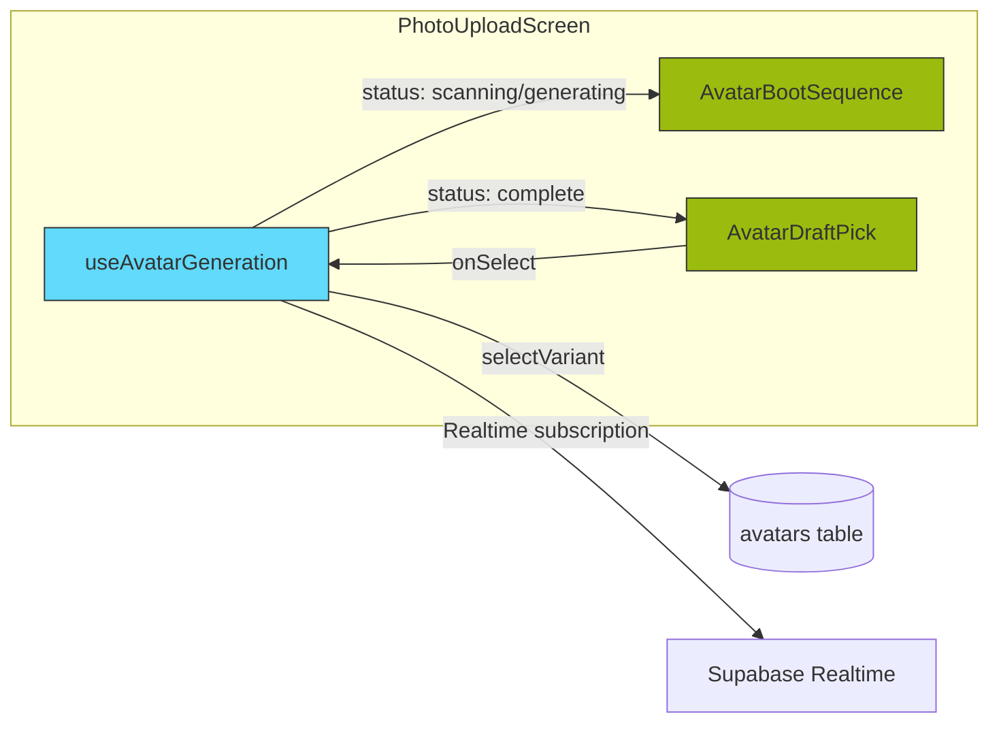

# Components

This section identifies the major logical components of the 16BitFit-V3 system, defining their responsibilities and how they interact within the Monorepo structure.

---

## Changelog

| Date | Version | Changes |
|------|---------|---------|
| 2025-12-31 | 1.1 | Added React Native UI Components section (AvatarBootSequence, AvatarDraftPick organisms). Added Custom Hooks section (useAvatarGeneration). Updated External AI reference to Runware. |
| 2025-10-XX | 1.0 | Initial document with system components |

---

## System Component List

### Component: Mobile Shell (React Native App)

* **Responsibility:** Provides the native application container, renders the main UI (Home Dashboard, Settings, Profile, Workout Tracker), manages navigation, handles native API interactions (HealthKit/Connect, Haptics), hosts the WebView, and orchestrates communication via the Hybrid Velocity Bridge.
* **Key Interfaces:** Renders React Native UI components (packages/ui-components), Communicates with Supabase backend (Auth, DB, Realtime) via Supabase client, Interacts with native Health APIs, Sends/receives messages to/from Phaser via the Hybrid Velocity Bridge (packages/bridge-interface), Hosts the WebView component containing the Phaser game.
* **Dependencies:** packages/shared-types, packages/bridge-interface, Supabase Client, React Navigation, Reanimated, Skia, Native Health Modules, **Local WebSocket Server Module**, **MessagePack Library**.
* **Technology Stack:** React Native, TypeScript, NativeWind, Zustand, Reanimated 4, react-native-skia.

### Component: Game Engine (Phaser 3 WebView)

* **Responsibility:** Renders and manages the core 2D fighting game experience (combat, character animations, physics, input handling), receives fitness-derived stats/energy, and communicates game events/results back to the shell via the Hybrid Velocity Bridge.
* **Key Interfaces:** Renders game visuals using Phaser 3 API, Receives input commands, Sends/receives messages to/from React Native via the Hybrid Velocity Bridge (packages/bridge-interface), Loads assets.
* **Dependencies:** Phaser 3, packages/bridge-interface (conceptually), **MessagePack Library**.
* **Technology Stack:** Phaser 3, JavaScript (or TypeScript, TBD).

### Component: Hybrid Velocity Bridge (Interface/Protocol)

* **Responsibility:** Defines the low-latency communication protocol (**Local WebSocket + MessagePack**) and mechanism between the React Native shell and the Phaser WebView. Implementation exists on both sides.
* **Key Interfaces:** Provides methods/event listeners for sending/receiving structured **binary** messages (defined in packages/bridge-interface), Handles MessagePack serialization/deserialization.
* **Dependencies:** packages/shared-types, **MessagePack Library**, **WebSocket Server/Client**.
* **Technology Stack:** TypeScript (RN side), JavaScript/TypeScript (Phaser side), Native WebSocket Server Module, WebView WebSocket API, MessagePack.

### Component: Supabase Backend (BaaS)

* **Responsibility:** Provides core backend services including user authentication, data persistence (PostgreSQL), real-time data synchronization (Broadcast), serverless functions (Edge + PG) for specific logic, and file storage.
* **Key Interfaces:** Supabase Client Library API, PostgREST API, Realtime Subscription API, Auth API, Edge Function invocation endpoint(s).
* **Dependencies:** External AI APIs (Runware).
* **Technology Stack:** Supabase Platform (PostgreSQL, GoTrue, Realtime, Deno Edge Functions, PL/pgSQL Functions).

### Component: Edge Functions (Supabase)

* **Responsibility:** Executes specific server-side logic, primarily for API ingress, request validation, orchestration, and secure interactions with external APIs (e.g., AI avatar generation via Runware). Defers data-intensive logic to PG Functions.
* **Key Interfaces:** HTTPS endpoints invokable by the RN Shell, Supabase Client Library API, External AI API clients, **May call PG Functions (RPC)**.
* **Dependencies:** Supabase Client, External AI API SDKs/clients, packages/shared-types.
* **Technology Stack:** Deno, TypeScript.

### Component: PostgreSQL Functions (PL/pgSQL)

* **Responsibility:** Executes core data-intensive business logic (e.g., EPP calculations, stat updates) atomically within the database, triggered by data changes or called from Edge Functions. Implements logic requiring transactional integrity. Initiates Realtime Broadcasts.
* **Key Interfaces:** Trigger functions, RPC functions callable from Supabase client/Edge Functions.
* **Dependencies:** Supabase DB schema.
* **Technology Stack:** PL/pgSQL.

### Component: Shared Types (packages/shared-types)

* **Responsibility:** Defines shared TypeScript interfaces and types used across the Monorepo (e.g., API request/response payloads, bridge message formats, data model types).
* **Key Interfaces:** Exports TypeScript types.
* **Dependencies:** None.
* **Technology Stack:** TypeScript.

### Component: Bridge Interface (packages/bridge-interface)

* **Responsibility:** Defines the specific **MessagePack** message structures, constants, and potentially utility functions for the Hybrid Velocity Bridge protocol.
* **Key Interfaces:** Exports types and potentially functions related to bridge communication.
* **Dependencies:** packages/shared-types.
* **Technology Stack:** TypeScript.

---

## React Native UI Components

This section documents the key React Native UI components organized by atomic design level. For the complete design system documentation, see [CLAUDE.md](../../CLAUDE.md).

### Organisms

Organisms are complex UI components composed of multiple molecules and atoms. They represent distinct sections of the UI with specific functionality.

---

#### AvatarBootSequence

**Purpose:** Displays phased loading animation during avatar generation, providing engaging visual feedback while the AI processes the user's selfie.

**File:** `apps/mobile-shell/src/components/organisms/AvatarBootSequence/index.tsx`

**Props:**

| Prop | Type | Required | Description |
|------|------|----------|-------------|
| `status` | `'scanning' \| 'generating' \| 'complete'` | Yes | Current generation phase |
| `cannyUrl` | `string \| null` | No | URL of Canny edge map to display |

**Behavior by Phase:**

| Phase | Status Value | Visual | Label |
|-------|--------------|--------|-------|
| 1 | `scanning` | Canny map with green tint overlay | "SCANNING BIOMETRICS..." |
| 2 | `generating` | Progress bar + DMG palette preview | "QUANTIZING 4-BIT COLOR..." |
| 3 | `complete` | Flash transition | "GENERATION COMPLETE" |

**Animation Details:**
- Canny map fades in with 500ms delay after `scanning` status
- Progress bar animates to 75% during `generating`, completes to 100% on `complete`
- DMG palette colors displayed as 32×32px swatches below progress bar

**Dependencies:**
- `PixelText` (atom)
- `PixelProgressBar` (atom)
- `react-native-reanimated` for animations
- Design system tokens

**Usage:**
```tsx
import { AvatarBootSequence } from '@/components/organisms/AvatarBootSequence';

<AvatarBootSequence
  status={generationStatus}
  cannyUrl={cannyUrl}
/>
```

**Related:** Used by `PhotoUploadScreen` during avatar generation flow.

---

#### AvatarDraftPick

**Purpose:** Displays two avatar variants side-by-side for user selection, implementing the "Draft Pick" UX pattern where users choose between "Accuracy" (high likeness) and "Retro" (high style) variants.

**File:** `apps/mobile-shell/src/components/organisms/AvatarDraftPick/index.tsx`

**Props:**

| Prop | Type | Required | Description |
|------|------|----------|-------------|
| `accuracyUrl` | `string` | Yes | URL of high-likeness variant |
| `retroUrl` | `string` | Yes | URL of high-style variant |
| `onSelect` | `(variant: 'accuracy' \| 'retro') => void` | Yes | Callback when user confirms selection |

**Behavior:**
1. Displays two cards in horizontal layout
2. Each card shows:
   - 128×128 avatar image in `PixelBorder`
   - Variant label ("ACCURACY" or "RETRO")
   - Description ("True to you" or "Classic style")
3. Tapping a card highlights it (thicker border, background change)
4. "CONFIRM SELECTION" button is disabled until a variant is selected
5. Pressing confirm calls `onSelect` with the selected variant

**Visual States:**

| State | Border Width | Border Color | Background |
|-------|--------------|--------------|------------|
| Unselected | `medium` (3px) | `dmg.dark` | `dmg.lightest` |
| Selected | `thick` (4px) | `dmg.darkest` | `dmg.light` |

**Dependencies:**
- `PixelText` (atom)
- `PixelButton` (atom)
- `PixelBorder` (atom)
- Design system tokens

**Usage:**
```tsx
import { AvatarDraftPick } from '@/components/organisms/AvatarDraftPick';

<AvatarDraftPick
  accuracyUrl={accuracyUrl}
  retroUrl={retroUrl}
  onSelect={(variant) => handleVariantSelection(variant)}
/>
```

**Related:** Used by `PhotoUploadScreen` after avatar generation completes.

---

#### GameBoyShell

**Purpose:** Wraps screen content in a decorative Game Boy hardware frame for presentation and marketing materials.

**File:** `apps/mobile-shell/src/components/organisms/GameBoyShell/index.tsx`

**Props:**

| Prop | Type | Required | Description |
|------|------|----------|-------------|
| `children` | `ReactNode` | Yes | Screen content to display in LCD area |

**Note:** This component is primarily used for mockups and screenshots. Production screens render directly without the shell frame.

---

## Custom Hooks

This section documents custom React hooks that encapsulate complex business logic.

---

### useAvatarGeneration

**Purpose:** Manages the complete avatar generation lifecycle including file upload, Edge Function calls, Realtime subscriptions, and variant selection.

**File:** `apps/mobile-shell/src/hooks/useAvatarGeneration.ts`

**Return Type:**

```typescript
interface UseAvatarGenerationReturn {
  // State
  status: GenerationStatus;
  jobId: string | null;
  cannyUrl: string | null;
  accuracyUrl: string | null;
  retroUrl: string | null;
  error: string | null;

  // Actions
  startGeneration: (photoUri: string) => Promise<void>;
  selectVariant: (variant: 'accuracy' | 'retro') => Promise<void>;
  reset: () => void;
}

type GenerationStatus =
  | 'idle'        // Initial state, ready to start
  | 'uploading'   // Uploading selfie to temp storage
  | 'scanning'    // Preprocessing complete, showing Canny map
  | 'generating'  // Waiting for AI generation
  | 'complete'    // Both variants ready
  | 'error';      // Something failed
```

**Behavior:**

| Method | Description |
|--------|-------------|
| `startGeneration(photoUri)` | Uploads photo to temp storage, calls Edge Function, subscribes to Realtime |
| `selectVariant(variant)` | Updates `avatars` table with selection, updates `user_profiles.home_avatar_url` |
| `reset()` | Resets all state to initial values, unsubscribes from Realtime |

**State Transitions:**

```
idle → uploading → scanning → generating → complete
                                        ↘ error
```

**Realtime Subscription:**
- Subscribes to `avatars` table filtered by `id=jobId`
- Listens for `UPDATE` events
- Updates `accuracyUrl`/`retroUrl` when columns populate
- Transitions to `complete` when both URLs are present

**Error Handling:**
- Upload failures: Sets `status: 'error'`, populates `error` message
- Edge Function errors: Sets `status: 'error'`, populates `error` message
- Network timeouts: Automatically retried by Supabase client

**Usage:**
```tsx
import { useAvatarGeneration } from '@/hooks/useAvatarGeneration';

function PhotoUploadScreen() {
  const {
    status,
    cannyUrl,
    accuracyUrl,
    retroUrl,
    startGeneration,
    selectVariant,
    reset,
  } = useAvatarGeneration();

  const handleCapture = async (photoUri: string) => {
    await startGeneration(photoUri);
  };

  const handleSelect = async (variant: 'accuracy' | 'retro') => {
    await selectVariant(variant);
    navigation.navigate('Home');
  };

  if (status === 'scanning' || status === 'generating') {
    return <AvatarBootSequence status={status} cannyUrl={cannyUrl} />;
  }

  if (status === 'complete') {
    return (
      <AvatarDraftPick
        accuracyUrl={accuracyUrl!}
        retroUrl={retroUrl!}
        onSelect={handleSelect}
      />
    );
  }

  return <PhotoCapture onCapture={handleCapture} />;
}
```

**Dependencies:**
- `@supabase/supabase-js` - Database and Realtime client
- Supabase Edge Function `generate-avatar`
- `avatars` table with Realtime enabled

**Related Documentation:**
- [Avatar Generation Workflow](./core-workflows.md#workflow-2-avatar-generation-async-webhook-architecture)
- [External APIs - Runware](./external-apis.md)
- [Implementation Spec](./avatar-generation-implementation-spec.md)

---

## Component Diagrams

### High-Level Container Diagram (Conceptual C4 Style)

```mermaid
graph TD
    User[User] --> MobileApp[Mobile App\n(React Native)];

    subgraph "Supabase Cloud"
        SupabaseDB[(Database\nPostgreSQL)];
        SupabaseAuth[Auth Service];
        SupabaseRT[Realtime Service\n(Broadcast)];
        SupabaseFuncs[Edge Functions\n(Ingress, External Calls)];
        PGFuncs[PostgreSQL Functions\n(Core Logic)];
        SupabaseStorage[(Storage)];

        SupabaseDB -- Triggers --> PGFuncs;
        PGFuncs --> SupabaseDB;
        PGFuncs -- Initiates --> SupabaseRT;
        SupabaseFuncs --> PGFuncs;
        SupabaseFuncs --> SupabaseDB;
    end

    subgraph "Mobile App Container"
        MobileApp --> RNShell[React Native Shell\n(UI, Native APIs, Bridge Client)];
        RNShell --> WebSocketServer[Local WebSocket Server];
        RNShell --> WebView[WebView\n(Hosts Phaser)];
        WebView --> PhaserEngine[Phaser 3 Engine\n(Combat Logic, Bridge Client)];

        WebSocketServer <-.->|MessagePack over WS| PhaserEngine;
    end

    RNShell --> SupabaseAuth;
    RNShell --> SupabaseDB;
    RNShell --> SupabaseRT;
    RNShell --> SupabaseFuncs;
    RNShell --> SupabaseStorage;
    RNShell --> HealthAPI[HealthKit / Health Connect];

    SupabaseFuncs --> ExternalAI[Runware API\n(Avatar Generation)];

    style SupabaseDB fill:#3ecf8e,stroke:#333
    style SupabaseAuth fill:#3ecf8e,stroke:#333
    style SupabaseRT fill:#3ecf8e,stroke:#333
    style SupabaseFuncs fill:#3ecf8e,stroke:#333
    style PGFuncs fill:#3ecf8e,stroke:#333
    style SupabaseStorage fill:#3ecf8e,stroke:#333
    style HealthAPI fill:#f9f,stroke:#333
    style ExternalAI fill:#f9f,stroke:#333
    style RNShell fill:#61DAFB,stroke:#333
    style WebView fill:#61DAFB,stroke:#333
    style PhaserEngine fill:#9f55ff,stroke:#333
    style WebSocketServer fill:#ffcc00,stroke:#333
```

### Avatar Generation Component Flow



---

*Last Updated: 2025-12-31*
*Document Version: 1.1*
