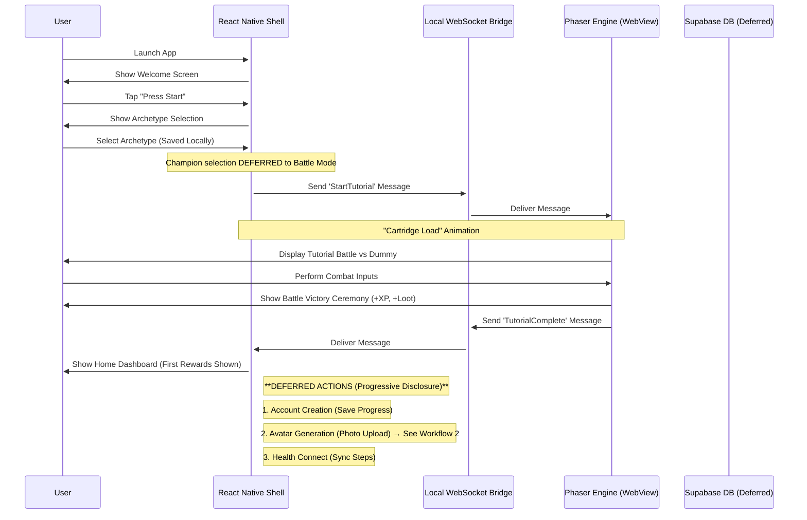
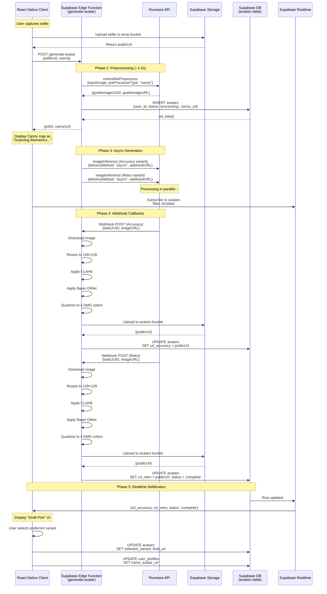
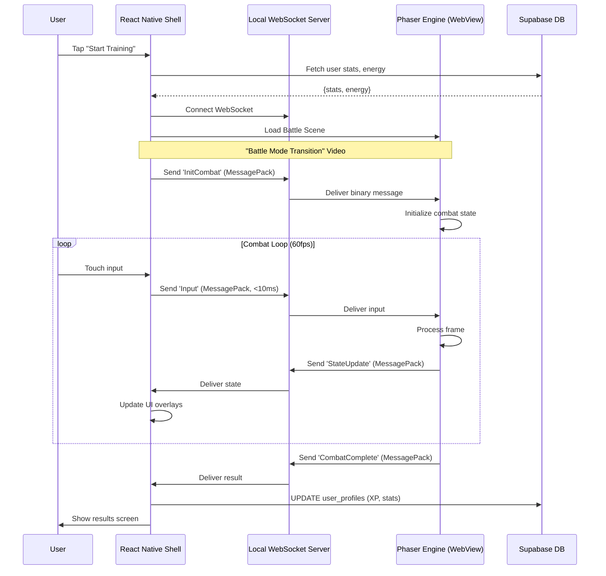
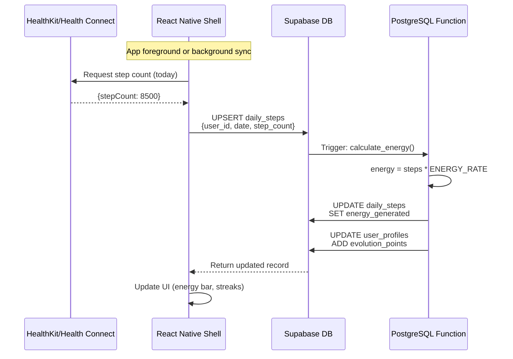

# Core Workflows

This document illustrates key user workflows using sequence diagrams to clarify interactions between the major system components.

---

## Changelog

| Date | Version | Changes |
|------|---------|---------|
| 2026-01-02 | 2.1 | **Party Mode Alignment:** Updated Workflow 1 to clarify Champion selection happens in Battle Mode (not onboarding). Added Party Mode design notes and terminology. |
| 2025-12-31 | 2.0 | Added Avatar Generation Workflow (Async Webhook Architecture). Updated onboarding workflow to reference new avatar flow. |
| 2025-10-XX | 1.0 | Initial document with First-Time Onboarding workflow |

---

## Workflow 1: First-Time Onboarding & Initial Loop ("Hook-First")

This workflow captures the user's first interaction with the app, designed to deliver value (a sample combat experience) before requiring registration or health permissions.



### Workflow 1 Key Points

- **Hook-First Design:** Users experience combat before registration friction
- **Local State:** Archetype selection stored locally until account creation
- **Champion Selection (Party Mode 2025-12-29):** Champion selection happens **in Battle Mode (Phaser landscape view)** via SF2-style 2×3 grid—NOT during onboarding. All 6 champions (Sean, Mary, Marcus, Aria, Kenji, Zara) are cosmetic-only with identical stats.
- **Progressive Disclosure:** Advanced features (avatar, health sync) introduced after initial engagement
- **Avatar Generation:** Triggers Workflow 2 when user opts in
- **No-Defeat Philosophy:** Battle outcomes are `victory` or `continue_training`—users are never punished

---

## Workflow 2: Avatar Generation (Async Webhook Architecture)

This workflow generates a personalized DMG-style pixel art avatar from a user selfie using the "Smooth-to-Pixel" architecture with Runware AI.

### Overview

```
Client Request → Preprocessing (Sync) → Generation (Async) → Webhook → Post-Processing → Storage → Realtime Notification
```

### Sequence Diagram



### Phase Details

#### Phase 1: Client Request

**Trigger:** User taps "Create Avatar" or enters Photo Upload screen during onboarding.

**Actions:**
1. Client captures or selects photo from library
2. Client uploads selfie to `temp` storage bucket
3. Client calls Edge Function with `selfieUrl` and `userId`

**Data Flow:**
```typescript
// Client → Edge Function
POST /functions/v1/generate-avatar
{
  "selfieUrl": "https://.../temp/uploads/123456.jpg",
  "userId": "550e8400-e29b-41d4-a716-446655440000"
}
```

---

#### Phase 2: Preprocessing (Synchronous, ~1-2s)

**Purpose:** Generate Canny edge map for ControlNet guidance and provide immediate feedback to client.

**Why Synchronous:** The client needs the Canny URL immediately to display the "Scanning Biometrics..." animation while generation happens asynchronously.

**Actions:**
1. Edge Function calls Runware `controlNetPreprocess` API
2. Receives `guideImageUUID` (for generation) and `guideImageURL` (for client)
3. Creates database record with status `processing`
4. Returns `{jobId, cannyUrl}` to client immediately

**Runware Request:**
```json
{
  "taskType": "controlNetPreprocess",
  "taskUUID": "<uuid>",
  "inputImage": "<selfie_url>",
  "preProcessorType": "canny",
  "outputType": "URL"
}
```

**Client Response:**
```json
{
  "jobId": "550e8400-e29b-41d4-a716-446655440000",
  "cannyUrl": "https://runware.ai/canny/abc123.png"
}
```

---

#### Phase 3: Generation (Asynchronous)

**Purpose:** Generate two avatar variants using the Tri-Signal pipeline without blocking the client.

**Why Asynchronous:** Image generation takes 3-8 seconds. Async webhook prevents mobile timeouts and provides better UX.

**Actions:**
1. Edge Function fires two generation requests to Runware with `deliveryMethod: "async"`
2. Each request includes unique `taskUUID` pattern: `<jobId>_<variant>`
3. Client subscribes to Supabase Realtime for updates on the avatars table
4. Client displays Canny map with "Scanning Biometrics..." animation

**Tri-Signal Configuration:**

| Signal | Component | Purpose |
|--------|-----------|---------|
| **Signal 1** | ControlNet Canny | Locks facial geometry/structure |
| **Signal 2** | IP-Adapter FaceID | Injects facial features for likeness |
| **Signal 3** | Text Prompt | Directs cel-shaded vector art style |

**Variant Weights:**

| Variant | ControlNet Weight | IP-Adapter Weight | Result |
|---------|-------------------|-------------------|--------|
| **Accuracy** | 0.50 | 0.55 | Higher likeness |
| **Retro** | 0.45 | 0.35 | More stylized |

---

#### Phase 4: Webhook Processing

**Purpose:** Receive completed AI images, apply deterministic post-processing, and update database.

**Trigger:** Runware calls webhook URL when each generation completes.

**Actions (per variant):**
1. Parse `taskUUID` to extract `jobId` and `variant`
2. Download generated image from Runware URL
3. Resize to 128×128 pixels (Lanczos interpolation)
4. Apply CLAHE (Contrast Limited Adaptive Histogram Equalization)
5. Apply Bayer 4×4 dithering (spread: 45)
6. Quantize to 4 DMG palette colors
7. Upload processed PNG to `avatars` storage bucket
8. Update database record with public URL

**Post-Processing Pipeline:**
```
AI Output (1024×1024, smooth vector art)
    ↓
Resize (Lanczos → 128×128)
    ↓
CLAHE (clipLimit: 2.0, gridSize: 8)
    ↓
Bayer Dither (4×4 matrix, spread: 45)
    ↓
Palette Quantization (4 DMG colors)
    ↓
Final Output (128×128, exactly 4 colors)
```

**DMG Palette (Non-Negotiable):**
```
#0F380F - Darkest (Deep forest shadow)
#306230 - Dark (Pine border)
#8BAC0F - Light (Lime highlight)
#9BBC0F - Lightest (Neon grass glow)
```

**TaskUUID Correlation:**
```typescript
// Webhook receives taskUUID like: "550e8400-e29b-41d4-a716-446655440000_accuracy"
const [jobId, variant] = taskUUID.split("_");
// jobId = "550e8400-e29b-41d4-a716-446655440000"
// variant = "accuracy" | "retro"
```

---

#### Phase 5: Client Completion

**Purpose:** Notify client when generation is complete and allow user to select preferred variant.

**Trigger:** Database update triggers Supabase Realtime notification.

**Actions:**
1. Client receives Realtime update with `url_accuracy` and `url_retro`
2. Client transitions from "Scanning..." to "Draft Pick" selection UI
3. User views both variants side-by-side and selects preference
4. Client updates `avatars.selected_variant` and `avatars.final_url`
5. Client updates `user_profiles.home_avatar_url` with selected avatar

**Draft Pick UI:**
- Split-screen layout showing both variants
- "ACCURACY" label (True to you)
- "RETRO" label (Classic style)
- Selection highlight on tap
- "CONFIRM SELECTION" button

**Final Database State:**
```sql
-- avatars table
{
  id: "550e8400-...",
  user_id: "user-uuid",
  status: "complete",
  canny_url: "https://...",
  url_accuracy: "https://.../accuracy.png",
  url_retro: "https://.../retro.png",
  selected_variant: "accuracy",
  final_url: "https://.../accuracy.png"
}

-- user_profiles table
{
  id: "user-uuid",
  home_avatar_url: "https://.../accuracy.png"
}
```

---

### Error Handling

| Error | Detection | Recovery |
|-------|-----------|----------|
| Preprocessing timeout | No response in 10s | Retry once, then DSP fallback |
| Generation timeout | No webhook in 60s | Mark job failed, notify user |
| Runware API error | HTTP 4xx/5xx | Retry with exponential backoff (max 3) |
| Post-processing error | Exception in webhook | Log error, mark job failed |
| Storage upload error | Supabase error | Retry 3x with backoff |

**DSP Fallback:** If AI generation fails completely, apply deterministic "Game Boy Camera" filter (grayscale → CLAHE → dither → quantize) to the original selfie.

---

### Timing Expectations

| Phase | Duration | Notes |
|-------|----------|-------|
| Upload selfie | ~500ms | Depends on image size |
| Preprocessing | ~1-2s | Synchronous, includes network |
| Client receives jobId | ~1.5s total | From tap to "Scanning..." display |
| AI Generation | ~3-8s | Async, two variants in parallel |
| Post-processing | ~500ms per variant | CLAHE + dither in webhook |
| **Total user wait** | **~5-12s** | From capture to selection |

---

### Related Documentation

- **Implementation Spec:** [avatar-generation-implementation-spec.md](./avatar-generation-implementation-spec.md)
- **External APIs:** [external-apis.md](./external-apis.md)
- **Database Schema:** `supabase/migrations/20251231_avatar_generation_v2.sql`
- **Edge Function:** `supabase/functions/generate-avatar/index.ts`
- **React Native Hook:** `apps/mobile-shell/src/hooks/useAvatarGeneration.ts`

---

## Workflow 3: Combat Session (Bridge Communication)

This workflow illustrates how combat sessions use the Hybrid Velocity Bridge for low-latency communication between React Native and Phaser.



### Combat Session Key Points

- **Sub-10ms Latency:** Local WebSocket + MessagePack enables responsive controls
- **Fixed Timestep:** 60fps game loop with deterministic state updates
- **State Serialization:** MessagePack binary format for efficient data transfer
- **Rollback-Ready:** State structure supports future PvP rollback netcode

---

## Workflow 4: Health Data Sync

This workflow shows how step data flows from device health APIs to the game.



### Health Sync Key Points

- **Privacy-First:** Only step counts collected (no GPS, heart rate)
- **Background Sync:** iOS/Android background fetch for passive updates
- **Evolution Points:** Steps contribute to character evolution progression
- **Combat Energy:** Daily steps generate energy for combat sessions

---

---

## Party Mode Design Decisions (2025-12-29)

The following design decisions affect multiple workflows:

### Champion Selection (Mario Party Model)

- **Champions are purely cosmetic** — no stat differences between the 6 champions
- **Selection happens in Battle Mode** — SF2-style 2×3 portrait grid in Phaser (landscape)
- **NOT during onboarding** — removes decision paralysis, gets users to combat faster
- **User's fitness powers ALL champions equally** — steps, workouts determine combat effectiveness

### No-Defeat Philosophy

- Battle outcomes: `victory` (stats gained) or `continue_training` (stats unchanged)
- `continue_training` message: "Your champion is resting... time to train more!"
- **XP is never removed, stats are never reduced**
- Avatar shows encouraging poses, never defeated poses

### Terminology

| Old Term | New Term | Context |
|----------|----------|---------|
| Quest | Training | Mode/menu level |
| Quest | Workout | Action/activity level |
| Fighter | Champion | Character selection |
| Loss/Defeat | Continue Training | Non-victory outcome |

---

*Last Updated: 2026-01-02*
*Document Version: 2.1*
