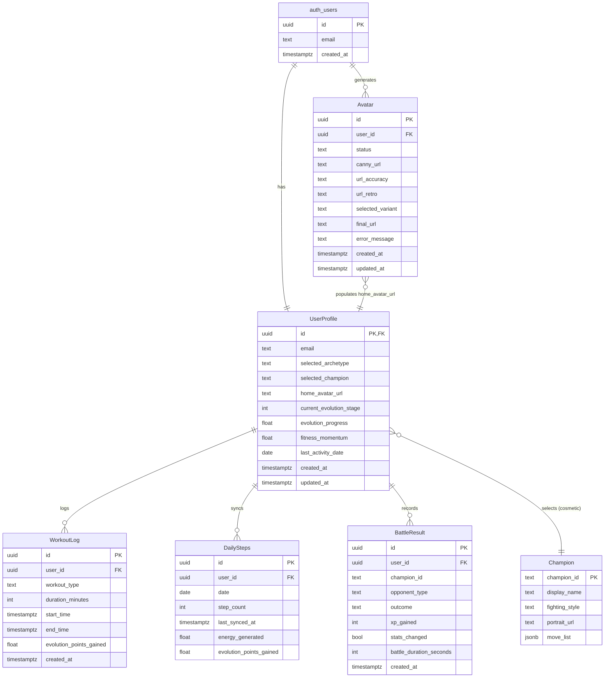

# Data Models

This section defines the core data entities required for 16BitFit-V3. These models will inform the database schema design and the shared TypeScript interfaces used between the React Native shell, Phaser WebView (via bridge), and Supabase Edge Functions.

---

## Changelog

| Date | Version | Changes |
|------|---------|---------|
| 2026-01-02 | 2.0 | **Party Mode Alignment:** Updated UserProfile (`selected_champion` replaces `selected_combat_character`, `fitness_momentum` replaces `fitness_streak`). Deprecated `CombatCharacterStats` model. Added `Champion` model (6 cosmetic-only champions, Mario Party philosophy). Added `BattleResult` model (no-defeat philosophy). Updated ERD. |
| 2025-12-31 | 1.1 | Added Avatar model for generation pipeline. Updated UserProfile to document home_avatar_url population from Avatar.final_url. Added relationship to Avatar model. |
| 2025-10-XX | 1.0 | Initial data models document |

---

## Model: UserProfile

**Purpose:** Stores core user information, preferences, and links to other data. Aligns with Supabase Auth users table.

**Key Attributes:**

| Attribute | Type | Description |
|-----------|------|-------------|
| `id` | UUID | Primary key, references `auth.users.id` |
| `created_at` | TimestampTz | Timestamp of profile creation |
| `updated_at` | TimestampTz | Timestamp of last profile update |
| `email` | Text | User's email (optional if deferred auth) |
| `selected_archetype` | Text | Enum: 'Trainer', 'Runner', 'Yoga', 'Bodybuilder', 'Cyclist' |
| `selected_champion` | Text | Champion ID: 'sean', 'mary', 'marcus', 'aria', 'kenji', 'zara'. NULL until first Battle Mode entry. **(Party Mode 2025-12-29)** |
| `home_avatar_url` | Text | URL to the generated avatar image (populated from `Avatar.final_url`) |
| `current_evolution_stage` | Integer | Current evolution stage (e.g., 1, 2) |
| `evolution_progress` | Float | Current progress points towards the next stage |
| `fitness_momentum` | Float | Current momentum value with graceful decay (NOT binary streak). **(Party Mode 2025-12-29)** |
| `last_activity_date` | Date | Date of the last recorded fitness activity (for momentum/reactivity) |

**Deprecated Attributes:**

| Attribute | Replacement | Notes |
|-----------|-------------|-------|
| ~~`selected_combat_character`~~ | `selected_champion` | Party Mode 2025-12-29 |
| ~~`fitness_streak`~~ | `fitness_momentum` | Party Mode 2025-12-29 |

**Relationships:**

* One-to-one with `auth.users`
* One-to-many with `WorkoutLog`
* One-to-many with `DailySteps` (implicit via `user_id`)
* One-to-many with `Avatar` (user can generate multiple avatars over time)
* One-to-many with `BattleResult` (implicit via `user_id`) **(Party Mode 2025-12-29)**

**Notes:**

* `home_avatar_url` is populated when the user completes avatar generation and selects a variant. The URL is copied from `Avatar.final_url` for the selected avatar record.
* `selected_champion` is NULL during onboarding. Champion selection happens **in Battle Mode (Phaser landscape view)** on the SF2-style 2×3 grid, NOT during onboarding.

---

## Model: Champion (New - Party Mode 2025-12-29)

**Purpose:** Defines the 6 cosmetic-only champions available for selection in Battle Mode. **Champions have identical stats**—the Mario Party model where all characters are equal and the user's real-world fitness powers ALL champions equally.

> **Design Decision (Party Mode 2025-12-29):** Champions are purely cosmetic. There are no stat differences between champions. This eliminates "meta gaming" and ensures player identity/representation is the focus, not min-maxing character selection.

**Key Attributes (Static Config):**

| Attribute | Type | Description |
|-----------|------|-------------|
| `champion_id` | Text | Unique identifier: 'sean', 'mary', 'marcus', 'aria', 'kenji', 'zara' |
| `display_name` | Text | Display name: 'Sean', 'Mary', 'Marcus', 'Aria', 'Kenji', 'Zara' |
| `fighting_style` | Text | Flavor text for character identity |
| `portrait_url` | Text | Path to 64×64 portrait headshot for SF2-style selection grid |
| `idle_sprite_url` | Text | Path to idle animation sprite sheet |
| `victory_sprite_url` | Text | Path to victory pose sprite sheet |
| `move_list` | JSONB | Definitions of available moves (IDENTICAL for all champions) |

**Champion Roster (MVP: 6 Champions):**

| ID | Name | Fighting Style | Visual Theme |
|----|------|----------------|--------------|
| sean | Sean | MMA Fighter | Caucasian male, dirty blonde hair, steel blue eyes, white tank, neon blue pants |
| mary | Mary | Kickboxing Trainer | Caucasian female, brown ponytail, pink tank, purple shorts, purple headband |
| marcus | Marcus | Urban Boxer | Black male, gold boxing gloves, dark gray tank, light gray pants |
| aria | Aria | Dance Combat (Capoeira) | Latina female, magenta top, blue flowing pants |
| kenji | Kenji | Aikido/Tai Chi Master | Asian male, light gray meditation top, serene stance |
| zara | Zara | Power Lifter | Middle Eastern female, dark gray powerlifting tank, wrestling stance |

**Relationships:**

* Logically linked to `UserProfile.selected_champion`

**Implementation Note:**

Champions are defined as static configuration (TypeScript constants or JSON), NOT as a database table. All stats are identical across champions—the user's real-world fitness data determines combat effectiveness.

---

## Model: BattleResult (New - Party Mode 2025-12-29)

**Purpose:** Records battle outcomes with the no-defeat philosophy. Battle results are either `victory` or `continue_training`—there is NO defeat/loss state.

> **Design Decision (Party Mode 2025-12-29):** The no-defeat philosophy ensures users are never punished. A `continue_training` outcome means stats are unchanged and the user is encouraged to train more. XP is never removed, stats are never reduced.

**Key Attributes:**

| Attribute | Type | Description |
|-----------|------|-------------|
| `id` | UUID | Primary key |
| `user_id` | UUID | Foreign key referencing `UserProfile.id` |
| `champion_id` | Text | Champion used in battle |
| `opponent_type` | Text | e.g., 'training_dummy', 'boss_1' |
| `outcome` | Text | **ENUM: 'victory' \| 'continue_training'** (NO 'defeat' option) |
| `xp_gained` | Integer | XP awarded (victory: calculated, continue_training: 0) |
| `stats_changed` | Boolean | Whether stats were modified (victory: true, continue_training: false) |
| `battle_duration_seconds` | Integer | How long the battle lasted |
| `created_at` | TimestampTz | When the battle occurred |

**Outcome Messages:**

| Outcome | Avatar Reaction | Message |
|---------|-----------------|---------|
| victory | Victory pose | "Champion [name] is victorious!" |
| continue_training | Determined pose | "Your champion is resting... time to train more!" |

**Relationships:**

* Many-to-one with `UserProfile`

---

## Model: Avatar

**Purpose:** Stores avatar generation jobs and results. Tracks the full lifecycle from preprocessing through variant selection.

**Key Attributes:**

| Attribute | Type | Description |
|-----------|------|-------------|
| `id` | UUID | Primary key (also used as `jobId` for webhook correlation) |
| `user_id` | UUID | Foreign key referencing `auth.users.id` |
| `status` | Text | Generation status: 'processing', 'complete', 'failed' |
| `canny_url` | Text | Canny edge map URL (displayed during "Scanning Biometrics..." phase) |
| `url_accuracy` | Text | High-likeness variant URL (populated by webhook) |
| `url_retro` | Text | High-style variant URL (populated by webhook) |
| `selected_variant` | Text | User's choice: 'accuracy' or 'retro' |
| `final_url` | Text | The chosen avatar URL (copied from selected variant) |
| `error_message` | Text | Error details if status = 'failed' |
| `created_at` | TimestampTz | Timestamp of job creation |
| `updated_at` | TimestampTz | Timestamp of last update |

**Relationships:**

* Many-to-one with `auth.users` (user can have multiple avatar generations)
* Logically linked to `UserProfile` (`final_url` is copied to `user_profiles.home_avatar_url` after selection)

**Status Transitions:**

```
INSERT (status: 'processing')
    ↓
UPDATE (url_accuracy populated) ← Webhook callback
    ↓
UPDATE (url_retro populated, status: 'complete') ← Webhook callback
    ↓
UPDATE (selected_variant, final_url populated) ← Client selection
```

**Realtime Configuration:**

* Enabled for client subscription during generation
* Client subscribes with filter: `id=eq.<jobId>`
* Updates to `url_accuracy`, `url_retro`, and `status` trigger notifications

**RLS Policies:**

| Policy | Operation | Rule |
|--------|-----------|------|
| Users can view own avatars | SELECT | `auth.uid() = user_id` |
| Users can insert own avatars | INSERT | `auth.uid() = user_id` |
| Users can update own avatars | UPDATE | `auth.uid() = user_id` |
| Service role full access | ALL | `auth.role() = 'service_role'` |

**Indexes:**

* `idx_avatars_user_id` on `user_id` (fast user lookups)
* `idx_avatars_status` on `status` (admin queries)

**SQL Schema:**

```sql
CREATE TABLE IF NOT EXISTS public.avatars (
  id UUID PRIMARY KEY DEFAULT gen_random_uuid(),
  user_id UUID NOT NULL REFERENCES auth.users(id) ON DELETE CASCADE,
  status TEXT NOT NULL DEFAULT 'processing'
    CHECK (status IN ('processing', 'complete', 'failed')),
  canny_url TEXT,
  url_accuracy TEXT,
  url_retro TEXT,
  selected_variant TEXT CHECK (selected_variant IN ('accuracy', 'retro')),
  final_url TEXT,
  error_message TEXT,
  created_at TIMESTAMPTZ DEFAULT NOW(),
  updated_at TIMESTAMPTZ DEFAULT NOW()
);

-- Enable Realtime
ALTER PUBLICATION supabase_realtime ADD TABLE public.avatars;

-- Indexes
CREATE INDEX idx_avatars_user_id ON public.avatars(user_id);
CREATE INDEX idx_avatars_status ON public.avatars(status);
```

**Related Documentation:**

* [Avatar Generation Workflow](./core-workflows.md#workflow-2-avatar-generation-async-webhook-architecture)
* [External APIs - Runware](./external-apis.md)
* [Implementation Spec](./avatar-generation-implementation-spec.md)

---

## Model: WorkoutLog

**Purpose:** Records manually logged workouts by the user.

**Key Attributes:**

| Attribute | Type | Description |
|-----------|------|-------------|
| `id` | UUID | Primary key |
| `user_id` | UUID | Foreign key referencing `UserProfile.id` |
| `created_at` | TimestampTz | Timestamp when the log was created |
| `workout_type` | Text | Enum: 'Strength', 'Cardio', 'Flexibility' |
| `duration_minutes` | Integer | Duration of the workout |
| `start_time` | TimestampTz | Start time of the workout |
| `end_time` | TimestampTz | End time of the workout |
| `evolution_points_gained` | Float | Calculated points contributed to evolution progress |

**Relationships:**

* Many-to-one with `UserProfile`

---

## Model: DailySteps

**Purpose:** Stores daily step counts synced from health platforms.

**Key Attributes:**

| Attribute | Type | Description |
|-----------|------|-------------|
| `id` | UUID | Primary key |
| `user_id` | UUID | Foreign key referencing `UserProfile.id` |
| `date` | Date | The date for which the step count applies |
| `step_count` | Integer | Total steps for the day |
| `last_synced_at` | TimestampTz | Timestamp of the last sync for this day |
| `energy_generated` | Float | Calculated combat energy based on steps |
| `evolution_points_gained` | Float | Calculated points contributed to evolution progress |

**Relationships:**

* Many-to-one with `UserProfile`

---

## Model: CombatCharacterStats (DEPRECATED)

> **⚠️ DEPRECATED (Party Mode 2025-12-29):** This model has been replaced by the `Champion` model. Combat characters ("Sean", "Mary") have been replaced with 6 cosmetic-only Champions (Sean, Mary, Marcus, Aria, Kenji, Zara). All champions share identical stats powered by the user's fitness data.

See **Model: Champion** above for the current implementation.

---

## Entity Relationship Diagram



---

## Terminology Reference (Party Mode 2025-12-29)

| Old Term | New Term | Context |
|----------|----------|---------|
| Quest | Training | Mode/menu level |
| Quest | Workout | Action/activity level |
| Fighter | Champion | Character selection |
| Combat Character | Champion | Data model |
| Loss/Defeat | Continue Training | Non-victory outcome |
| Fitness Streak | Fitness Momentum | Graceful decay vs binary |

---

*Last Updated: 2026-01-02*
*Document Version: 2.0*
