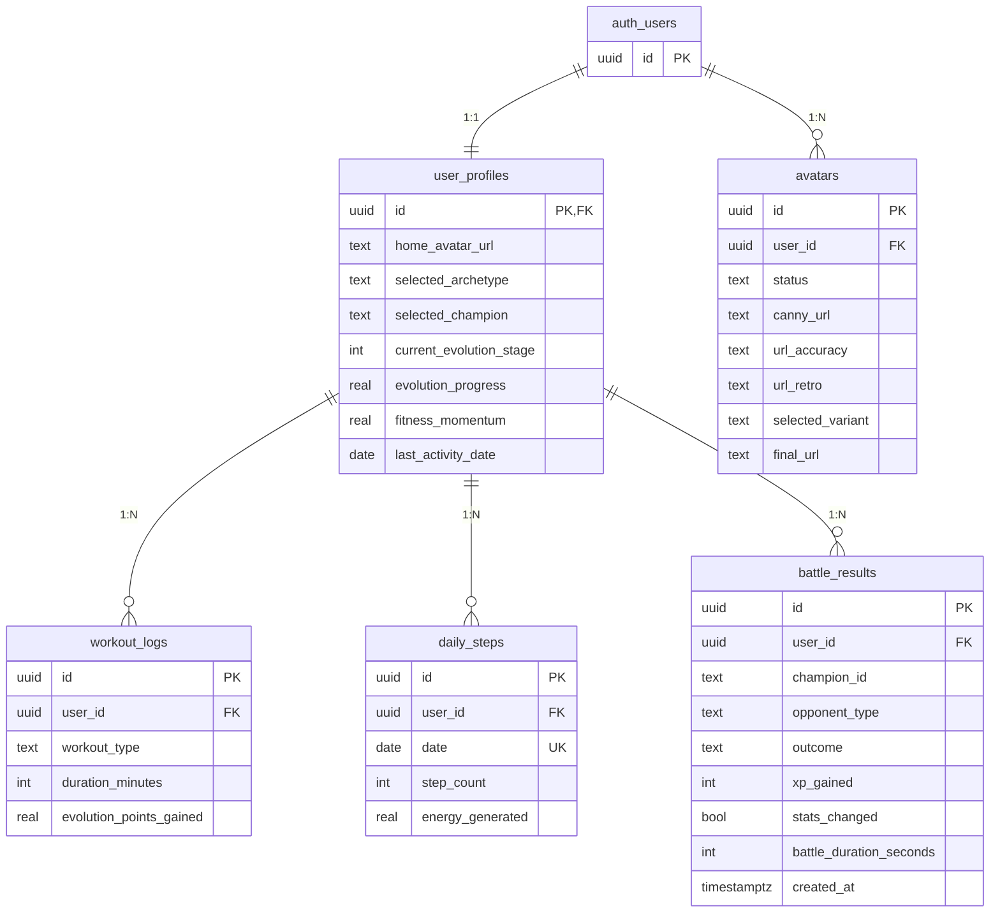

# Database Schema

This section defines the PostgreSQL schema for 16BitFit-V3, based on the conceptual data models. It includes table definitions, primary keys, foreign keys, basic indexes, enables Row Level Security (RLS), and notes where PostgreSQL Functions will handle logic.

---

## Changelog

| Date | Version | Changes |
|------|---------|---------|
| 2026-01-02 | 2.0 | **Party Mode Alignment:** Updated `user_profiles` table (`selected_champion` replaces `selected_combat_character`, `fitness_momentum` replaces `fitness_streak`, 6 champions). Added `battle_results` table (no-defeat philosophy). Updated schema diagram. |
| 2025-12-31 | 1.1 | Added `avatars` table for generation pipeline. Added Storage Buckets section (`temp`, `avatars`). Added RLS policies for storage. Added migration reference. |
| 2025-10-XX | 1.0 | Initial schema with user_profiles, workout_logs, daily_steps |

---

## Extensions

```sql
-- Enable UUID generation
CREATE EXTENSION IF NOT EXISTS "uuid-ossp";
```

---

## Tables

### User Profile Table

Stores core user information, linked to Supabase Auth.

```sql
-- ## User Profile Table ##
-- Stores core user information, linked to Supabase Auth
CREATE TABLE public.user_profiles (
  id UUID PRIMARY KEY REFERENCES auth.users(id) ON DELETE CASCADE, -- Links to auth.users
  created_at TIMESTAMPTZ NOT NULL DEFAULT now(),
  updated_at TIMESTAMPTZ NOT NULL DEFAULT now(),
  email TEXT UNIQUE, -- Can be NULL initially if deferred auth
  selected_archetype TEXT CHECK (selected_archetype IN ('Trainer', 'Runner', 'Yoga', 'Bodybuilder', 'Cyclist')),
  selected_champion TEXT CHECK (selected_champion IN ('sean', 'mary', 'marcus', 'aria', 'kenji', 'zara')), -- NULL until first Battle Mode entry (Party Mode 2025-12-29)
  home_avatar_url TEXT, -- URL to generated avatar
  current_evolution_stage INTEGER NOT NULL DEFAULT 1, -- Starts at stage 1
  evolution_progress REAL NOT NULL DEFAULT 0.0, -- Progress points
  fitness_momentum REAL NOT NULL DEFAULT 0.0, -- Momentum value with graceful decay (Party Mode 2025-12-29, replaces fitness_streak)
  last_activity_date DATE -- For momentum calculation
);

-- Enable RLS for user_profiles
ALTER TABLE public.user_profiles ENABLE ROW LEVEL SECURITY;

-- Policy: Users can view their own profile
CREATE POLICY "Allow individual user read access" ON public.user_profiles
  FOR SELECT USING (auth.uid() = id);

-- Policy: Users can update their own profile (selectively)
CREATE POLICY "Allow individual user update access" ON public.user_profiles
  FOR UPDATE USING (auth.uid() = id)
  WITH CHECK (auth.uid() = id);

-- Trigger to update updated_at timestamp
CREATE OR REPLACE FUNCTION public.handle_updated_at()
RETURNS TRIGGER AS $$
BEGIN
  NEW.updated_at = now();
  RETURN NEW;
END;
$$ LANGUAGE plpgsql;

CREATE TRIGGER on_user_profiles_updated
  BEFORE UPDATE ON public.user_profiles
  FOR EACH ROW
  EXECUTE PROCEDURE public.handle_updated_at();
```

**Party Mode Changes (2025-12-29):**

| Old Column | New Column | Notes |
|------------|------------|-------|
| `selected_combat_character` | `selected_champion` | 6 champions instead of 2, lowercase IDs |
| `fitness_streak` (INTEGER) | `fitness_momentum` (REAL) | Graceful decay instead of binary streak |

**Champion Selection Notes:**

- Champion is NULL during onboarding
- Selection happens in Battle Mode (Phaser landscape view) via SF2-style 2×3 grid
- All 6 champions are cosmetic-only with identical stats

---

### Battle Results Table (New - Party Mode 2025-12-29)

Records battle outcomes with the no-defeat philosophy. Outcomes are `victory` or `continue_training`—NO defeat state.

```sql
-- ## Battle Results Table ##
-- Records battle outcomes with no-defeat philosophy (Party Mode 2025-12-29)
-- Outcomes are 'victory' or 'continue_training' - NO defeat state
CREATE TABLE public.battle_results (
  id UUID PRIMARY KEY DEFAULT uuid_generate_v4(),
  user_id UUID NOT NULL REFERENCES public.user_profiles(id) ON DELETE CASCADE,
  champion_id TEXT NOT NULL CHECK (champion_id IN ('sean', 'mary', 'marcus', 'aria', 'kenji', 'zara')),
  opponent_type TEXT NOT NULL, -- e.g., 'training_dummy', 'boss_1'
  outcome TEXT NOT NULL CHECK (outcome IN ('victory', 'continue_training')), -- NO 'defeat' option
  xp_gained INTEGER NOT NULL DEFAULT 0, -- victory: calculated, continue_training: 0
  stats_changed BOOLEAN NOT NULL DEFAULT false, -- victory: true, continue_training: false
  battle_duration_seconds INTEGER,
  created_at TIMESTAMPTZ NOT NULL DEFAULT now()
);

-- Index for querying battles by user
CREATE INDEX idx_battle_results_user_id ON public.battle_results(user_id);
CREATE INDEX idx_battle_results_created_at ON public.battle_results(created_at DESC);

-- Enable RLS for battle_results
ALTER TABLE public.battle_results ENABLE ROW LEVEL SECURITY;

-- Policy: Users can view and create their own battle results
CREATE POLICY "Allow individual user battle access" ON public.battle_results
  FOR ALL USING (auth.uid() = user_id);
```

**No-Defeat Philosophy:**

| Outcome | XP Gained | Stats Changed | Avatar Reaction | Message |
|---------|-----------|---------------|-----------------|---------|
| `victory` | Calculated | true | Victory pose | "Champion [name] is victorious!" |
| `continue_training` | 0 | false | Determined pose | "Your champion is resting... time to train more!" |

---

### Avatars Table

Stores avatar generation jobs and results. Tracks the full lifecycle from preprocessing through variant selection.

**Migration File:** `supabase/migrations/20251231_avatar_generation_v2.sql`

```sql
CREATE TABLE IF NOT EXISTS public.avatars (
  id UUID PRIMARY KEY DEFAULT gen_random_uuid(),
  user_id UUID NOT NULL REFERENCES auth.users(id) ON DELETE CASCADE,
  status TEXT NOT NULL DEFAULT 'processing'
    CHECK (status IN ('processing', 'complete', 'failed')),
  canny_url TEXT,           -- Canny edge map URL (shown during "Scanning Biometrics...")
  url_accuracy TEXT,        -- High-likeness variant (populated by webhook)
  url_retro TEXT,           -- High-style variant (populated by webhook)
  selected_variant TEXT     -- User's choice: 'accuracy' | 'retro'
    CHECK (selected_variant IN ('accuracy', 'retro')),
  final_url TEXT,           -- The chosen avatar URL (copied from url_accuracy or url_retro)
  error_message TEXT,       -- Error details if status = 'failed'
  created_at TIMESTAMPTZ DEFAULT NOW(),
  updated_at TIMESTAMPTZ DEFAULT NOW()
);

-- Enable Realtime for client subscriptions during generation
ALTER PUBLICATION supabase_realtime ADD TABLE public.avatars;

-- Enable RLS
ALTER TABLE public.avatars ENABLE ROW LEVEL SECURITY;

-- Policy: Users can view their own avatars
CREATE POLICY "Users can view own avatars"
  ON public.avatars FOR SELECT
  USING (auth.uid() = user_id);

-- Policy: Users can insert their own avatars
CREATE POLICY "Users can insert own avatars"
  ON public.avatars FOR INSERT
  WITH CHECK (auth.uid() = user_id);

-- Policy: Users can update their own avatars (for variant selection)
CREATE POLICY "Users can update own avatars"
  ON public.avatars FOR UPDATE
  USING (auth.uid() = user_id);

-- Policy: Service role can do anything (for Edge Functions/webhooks)
CREATE POLICY "Service role full access"
  ON public.avatars FOR ALL
  USING (auth.role() = 'service_role');

-- Index for fast user lookups
CREATE INDEX idx_avatars_user_id ON public.avatars(user_id);

-- Index for admin queries by status
CREATE INDEX idx_avatars_status ON public.avatars(status);

-- Trigger for updated_at
CREATE TRIGGER on_avatars_updated
  BEFORE UPDATE ON public.avatars
  FOR EACH ROW
  EXECUTE PROCEDURE public.handle_updated_at();
```

**Column Details:**

| Column | Purpose |
|--------|---------|
| `id` | Primary key, also used as `jobId` for webhook correlation |
| `user_id` | Owner of the avatar generation job |
| `status` | Lifecycle state: `processing` → `complete` or `failed` |
| `canny_url` | Edge map URL returned from preprocessing, shown to user during wait |
| `url_accuracy` | High-likeness variant, populated by webhook handler |
| `url_retro` | High-style variant, populated by webhook handler |
| `selected_variant` | User's final choice after "Draft Pick" UI |
| `final_url` | Convenience copy of chosen URL, also copied to `user_profiles.home_avatar_url` |
| `error_message` | Diagnostic info if generation fails |

**Realtime Usage:**

Client subscribes to updates during generation:
```typescript
supabase
  .channel(`avatar-${jobId}`)
  .on('postgres_changes', {
    event: 'UPDATE',
    schema: 'public',
    table: 'avatars',
    filter: `id=eq.${jobId}`,
  }, handleUpdate)
  .subscribe();
```

---

### Workout Log Table

Records manually logged workouts.

```sql
CREATE TABLE public.workout_logs (
  id UUID PRIMARY KEY DEFAULT uuid_generate_v4(),
  user_id UUID NOT NULL REFERENCES public.user_profiles(id) ON DELETE CASCADE,
  created_at TIMESTAMPTZ NOT NULL DEFAULT now(),
  workout_type TEXT NOT NULL CHECK (workout_type IN ('Strength', 'Cardio', 'Flexibility')),
  duration_minutes INTEGER NOT NULL CHECK (duration_minutes > 0),
  start_time TIMESTAMPTZ NOT NULL,
  end_time TIMESTAMPTZ NOT NULL CHECK (end_time > start_time),
  evolution_points_gained REAL NOT NULL DEFAULT 0.0
  -- Note: Calculation handled by PG Function triggered on insert
);

-- Index for querying workouts by user
CREATE INDEX idx_workout_logs_user_id ON public.workout_logs(user_id);

-- Enable RLS
ALTER TABLE public.workout_logs ENABLE ROW LEVEL SECURITY;

-- Policy: Users can manage their own workout logs
CREATE POLICY "Allow individual user management" ON public.workout_logs
  FOR ALL USING (auth.uid() = user_id);
```

---

### Daily Steps Table

Stores daily step counts synced from health platforms.

```sql
CREATE TABLE public.daily_steps (
  id UUID PRIMARY KEY DEFAULT uuid_generate_v4(),
  user_id UUID NOT NULL REFERENCES public.user_profiles(id) ON DELETE CASCADE,
  date DATE NOT NULL,
  step_count INTEGER NOT NULL DEFAULT 0 CHECK (step_count >= 0),
  last_synced_at TIMESTAMPTZ NOT NULL DEFAULT now(),
  energy_generated REAL NOT NULL DEFAULT 0.0,
  evolution_points_gained REAL NOT NULL DEFAULT 0.0,
  UNIQUE (user_id, date)  -- One record per user per day
  -- Note: Calculations handled by PG Function triggered on insert/update
);

-- Index for querying steps by user and date
CREATE INDEX idx_daily_steps_user_date ON public.daily_steps(user_id, date DESC);

-- Enable RLS
ALTER TABLE public.daily_steps ENABLE ROW LEVEL SECURITY;

-- Policy: Users can manage their own step data
CREATE POLICY "Allow individual user step management" ON public.daily_steps
  FOR ALL USING (auth.uid() = user_id);
```

---

## Storage Buckets

Supabase Storage buckets for avatar generation pipeline.

### temp Bucket

**Purpose:** Temporary storage for user selfie uploads before processing.

```sql
-- Create bucket
INSERT INTO storage.buckets (id, name, public, file_size_limit, allowed_mime_types)
VALUES (
  'temp',
  'temp',
  true,                                    -- Public read for AI API access
  10485760,                                -- 10MB limit
  ARRAY['image/jpeg', 'image/png', 'image/webp']
);

-- RLS: Authenticated users can upload to temp
CREATE POLICY "Authenticated users can upload to temp"
  ON storage.objects FOR INSERT
  WITH CHECK (
    bucket_id = 'temp'
    AND auth.role() = 'authenticated'
  );

-- RLS: Public read for temp (AI API needs to fetch)
CREATE POLICY "Public read for temp"
  ON storage.objects FOR SELECT
  USING (bucket_id = 'temp');

-- RLS: Users can delete their own temp uploads
CREATE POLICY "Users can delete own temp uploads"
  ON storage.objects FOR DELETE
  USING (
    bucket_id = 'temp'
    AND auth.uid()::text = (storage.foldername(name))[1]
  );
```

**Upload Path Pattern:** `uploads/{timestamp}.{ext}`

**Lifecycle:** Files should be cleaned up after avatar generation completes. Consider a scheduled job to purge files older than 24 hours.

---

### avatars Bucket

**Purpose:** Permanent storage for processed avatar images (128×128 PNG, 4-color DMG palette).

```sql
-- Create bucket
INSERT INTO storage.buckets (id, name, public, file_size_limit, allowed_mime_types)
VALUES (
  'avatars',
  'avatars',
  true,                     -- Public read for app display
  1048576,                  -- 1MB limit (128×128 PNG is ~10-50KB)
  ARRAY['image/png']
);

-- RLS: Service role can write avatars (Edge Function webhook handler)
CREATE POLICY "Service role can write avatars"
  ON storage.objects FOR INSERT
  WITH CHECK (
    bucket_id = 'avatars'
    AND auth.role() = 'service_role'
  );

-- RLS: Public read for avatars (displayed in app)
CREATE POLICY "Public read for avatars"
  ON storage.objects FOR SELECT
  USING (bucket_id = 'avatars');

-- RLS: Service role can update/overwrite avatars
CREATE POLICY "Service role can update avatars"
  ON storage.objects FOR UPDATE
  USING (bucket_id = 'avatars')
  WITH CHECK (auth.role() = 'service_role');
```

**Upload Path Pattern:** `{jobId}/{variant}.png`
- Example: `550e8400-e29b-41d4-a716-446655440000/accuracy.png`
- Example: `550e8400-e29b-41d4-a716-446655440000/retro.png`

**Public URL Format:**
```
https://{project-ref}.supabase.co/storage/v1/object/public/avatars/{jobId}/{variant}.png
```

---

## Storage Bucket Summary

| Bucket | Purpose | Public | Write Access | File Types |
|--------|---------|--------|--------------|------------|
| `temp` | Selfie uploads | Yes | Authenticated users | JPEG, PNG, WebP |
| `avatars` | Processed avatars | Yes | Service role only | PNG |

---

## PostgreSQL Functions & Triggers

### handle_updated_at (Utility)

Automatically updates `updated_at` timestamp on row modification.

```sql
CREATE OR REPLACE FUNCTION public.handle_updated_at()
RETURNS TRIGGER AS $$
BEGIN
  NEW.updated_at = now();
  RETURN NEW;
END;
$$ LANGUAGE plpgsql;
```

**Used by:** `user_profiles`, `avatars`

---

### Evolution Progress Functions (Conceptual)

```sql
-- Trigger Concept: Calculate EPP after step sync
-- CREATE TRIGGER calculate_epp_after_steps_upsert
--   AFTER INSERT OR UPDATE ON public.daily_steps
--   FOR EACH ROW
--   EXECUTE FUNCTION update_evolution_progress_from_steps();

-- Trigger Concept: Calculate EPP after workout log
-- CREATE TRIGGER calculate_epp_after_workout_log
--   AFTER INSERT ON public.workout_logs
--   FOR EACH ROW
--   EXECUTE FUNCTION update_evolution_progress_from_workout();

-- Function Concept (updates profile and triggers broadcast):
-- CREATE OR REPLACE FUNCTION update_evolution_progress_from_steps()
-- RETURNS TRIGGER AS $$
-- BEGIN
--   -- Calculate EPP based on NEW.step_count using asymptotic formula
--   -- UPDATE public.user_profiles SET evolution_progress = evolution_progress + calculated_epp WHERE id = NEW.user_id;
--   -- Perform Realtime Broadcast using pg_notify or Supabase realtime.broadcast function
--   RETURN NEW;
-- END;
-- $$ LANGUAGE plpgsql SECURITY DEFINER;
```

**Note:** These are conceptual placeholders. Actual implementations will be added when combat/evolution features are implemented.

---

## Migration Files

| Migration | Purpose | Date |
|-----------|---------|------|
| `20251231_avatar_generation_v2.sql` | Avatars table, storage buckets, RLS policies | 2025-12-31 |
| `20260102_party_mode_updates.sql` | User profiles Party Mode columns, battle_results table | 2026-01-02 |

**Location:** `supabase/migrations/`

---

## Schema Diagram



---

## Related Documentation

- [Data Models](./data-models.md) - Conceptual entity definitions
- [Avatar Generation Workflow](./core-workflows.md#workflow-2-avatar-generation-async-webhook-architecture)
- [External APIs - Runware](./external-apis.md)
- [Implementation Spec](./avatar-generation-implementation-spec.md)

---

*Last Updated: 2026-01-02*
*Document Version: 2.0*
